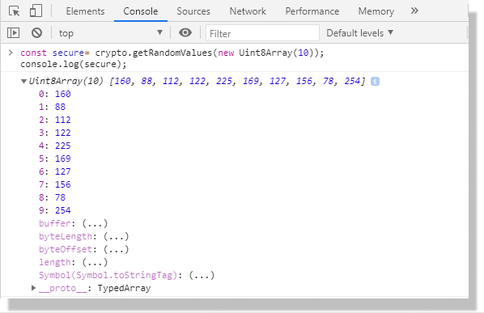
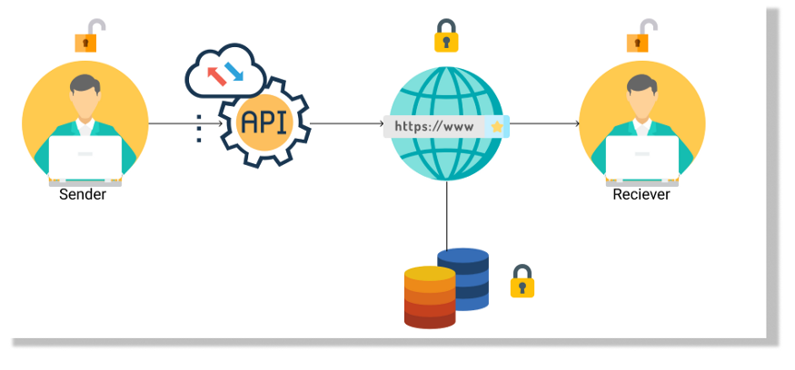
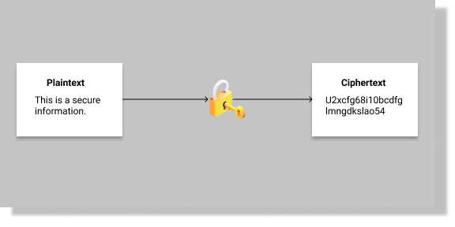
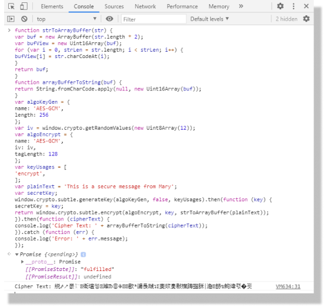
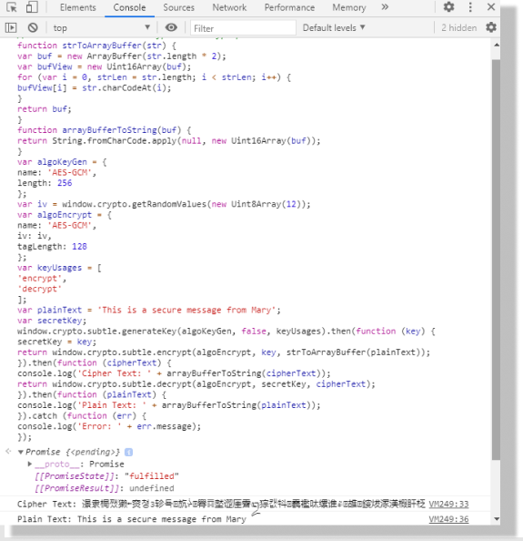
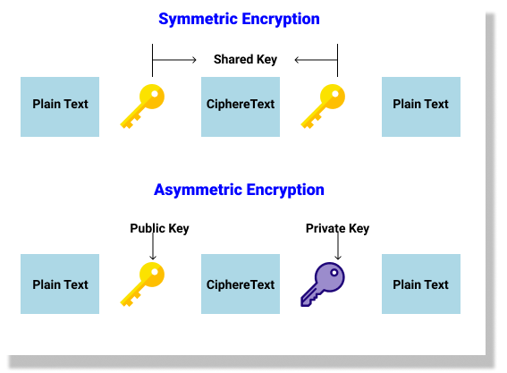
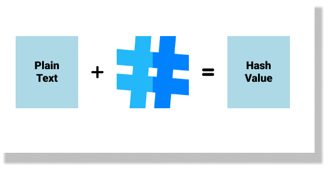
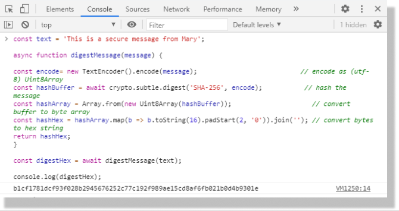
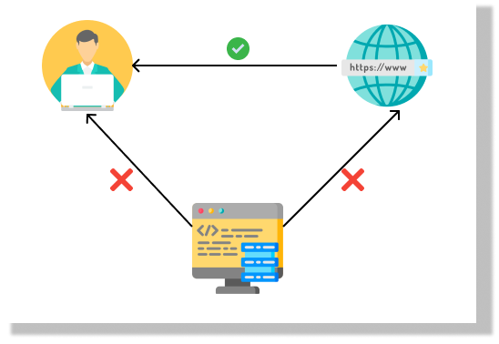
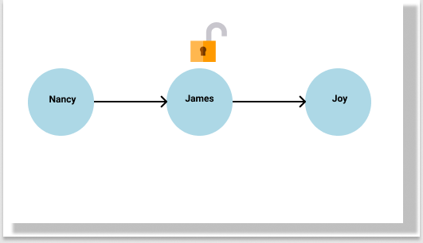

# 密码术及中间人攻击处理

> 原文请查阅[这里](https://blog.sessionstack.com/how-javascript-works-cryptography-how-to-deal-with-man-in-the-middle-mitm-attacks-bf8fc6be546c)，本文采用[知识共享署名 4.0 国际许可协议](http://creativecommons.org/licenses/by/4.0/)共享，BY [Troland](https://github.com/Troland)。

**这是 JavaScript 工作原理第二十四章。**


网络安全是 IT 行业的重要领域之一。每天都有许多人通过互联网与世界各地进行交流。当人们通过互联网进行通信时，信息在到达目的地之前可能会被窃听甚至劫持信息。同样，黑客也有可能利用计算机网络漏洞的窃取用户的个人数据。

那么人们如何才能安全地通过互联网发送信息，`JavaScript` 又将扮演什么角色？这篇文章将带你一同寻答案。

在本章中，您将了解密码术及其是如何在 `JavaScript` 中工作以及处理中间人攻击（MitM）。

## 什么是密码术

密码术主要关注保护信息和通信安全的过程，确保只有发送者和预定的接收方才能访问。密码术构造了各种技术用于正确地保护通信。这些技术包括使用密钥进行加密解密，使用各种算法对通信过程进行哈希处理，或签名生成和验证。

由于许多人使用 `JavaScript` 构建的移动应用程序在互联网上进行交流，因此有必要了解加密在 `JavaScript` 中的工作方式。在下一节中，我们将研究 `JavaScript` 的 Web 加密 API 及其如何支持加密。

## JavaScript Web 加密 API

确保通过互联网进行安全通信非常重要，因此部分浏览器已实现了 [`crypto`](https://developer.mozilla.org/en-US/docs/Web/API/Crypto)接口。但此接口定义不那么明确且听起来和密码术不那么相关。 `JavaScript` 的网络加密API 提供了一个定义明确的接口，称为 [`SubtleCrypto`](https://developer.mozilla.org/en-US/docs/Web/API/SubtleCrypto)。

加密 API 允许开发人员将基本的加密功能集成到他们的应用中而不需第三方库。您可以进行文档签名，身份验证或对通信进行完整性检查。

例如，开发者可以通过运行以下代码来获取 8 位无符号整数数组的加密安全随机数据：

```js
const secure = window.crypto.getRandomValues(new Uint8Array(10));
console.log(secure);
```
如果在 Chrome 的控制台上运行此代码，则会得到 10 个 8 位随机生成且未签名的数字的输出。



让我们看一下 `JavaScript` 的网络加密 API 的工作原理，以及如何从网络控制台中实现。

有了网络加密 API，由于其具有加密安全性，服务器就无法看到数据。仅发送者和接收者有权访问通信数据。



在上图例中，您可以看到 API​​ 对发送方的数据进行了加密。接收者使用密钥解密数据，服务器和数据库无法解密加密数据。您可以执行基本的加密操作，例如散列，签名生成和验证。至于加密和解密，这些将在本文中进一步讨论。

## 基本密码学函数

开发者可以使用 `JavaScript` 网络加密 API 执行多种加密功能。在本节中，我们将研究基本的加密函数，例如散列，签名生成和验证，加密和解密。

### 加密

加密是基本的密码学函数之一。在加密中，使用密钥将人类语言（纯文本）的消息转换为计算机语言（密文）。为了使接收者理解发送者的消息，他们必须使用密钥。



加密过程使用 `crypto` 方法。语法如下：

```js
// ncrypt 语法
const result = crypto.subtle.encrypt(algorithm, key, data);
```

`crypto` 方法将返回一个包含 `ArrayBuffer` (密文载体) 的 `Promise`。如果在加密过程中发生错误，最好返回一个拒绝的新 `Promise`，以规范化算法。为了更好地理解这一点，我们将使用 `AES-GCM` 密钥和算法对纯文本进行加密。在浏览器中复制以下代码，注意输出的是密文。

```js
/* The function strToArrayBuffer converts string to fixed-length raw binary data buffer because 
encrypt method must return a Promise that fulfills with an ArrayBuffer containing the "ciphertext"*/
function strToArrayBuffer(str) {
  var buf = new ArrayBuffer(str.length * 2);
  var bufView = new Uint16Array(buf);
  for (var i = 0, strLen = str.length; i < strLen; i++) {
    bufView[i] = str.charCodeAt(i);
  }
  return buf;
}
// The function arrayBufferToString converts fixed-length raw binary data buffer to 16-bit unsigned String as our plaintext
function arrayBufferToString(buf) {
  return String.fromCharCode.apply(null, new Uint16Array(buf));
}
// This object below will generate our algorithm key
var algoKeyGen = {
  name: "AES-GCM",
  length: 256,
};
// This will generate random values of 8-bit unsigned integer
var iv = window.crypto.getRandomValues(new Uint8Array(12));
// This object will generate our encryption algorithm
var algoEncrypt = {
  name: "AES-GCM",
  iv: iv,
  tagLength: 128,
};
// states that key usage is for encryption
var keyUsages = ["encrypt"];
var plainText = "This is a secure message from Mary";
var secretKey;
// This generates our secret Key with key generation algorithm
window.crypto.subtle
  .generateKey(algoKeyGen, false, keyUsages)
  .then(function (key) {
    secretKey = key;
  // Encrypt plaintext with key and algorithm converting the plaintext to ArrayBuffer
    return window.crypto.subtle.encrypt(
      algoEncrypt,
      key,
      strToArrayBuffer(plainText)
    );
  })
  .then(function (cipherText) {
  // print out Ciphertext in console
    console.log("Cipher Text: " + arrayBufferToString(cipherText));
  })
  .catch(function (err) {
    console.log("Error: " + err.message);
  });
```



观察代码，指定算法时也指明了 key 值。

```js
var algoKeyGen = { name: 'AES-GCM', length: 256};
```

```js
var algoEncrypt = { name: 'AES-GCM', iv: iv, tagLength: 128};
```

`strToArrayBuffer` 函数将纯文本转换为密文，因为要实现的 `Promise` 必须是带有密文的 [`ArrayBuffer`](https://developer.mozilla.org/en-US/docs/Web/JavaScript/Reference/Global_Objects/ArrayBuffer)。

### 解密

解密是加密的逆过程。解密中密文被转换回纯文本。为此，需要来自授权用户的密钥（密码）。这就像尝试使用钥匙来访问锁定的建筑物。您不会因为拥有一些钥匙而被带入建筑物。唯一允许您进入的方法是匹配的钥匙（可以打开建筑物）。

`JavaScript` 的网络加密API中的解密过程使用 `decrypt` 方法。以下是解密语法。

```js
// ciphertext 语法
const result = crypto.subtle.decrypt(algorithm, key, data);
```
解密上述密文例子的代码如下：

```js
// This states that the keyusage for decrypting
var keyUsages = ["decrypt"];
// This object below is for algorithm key generation
var algoKeyGen = {
  name: "AES-GCM",
  length: 256,
};
var plainText = "This is a secure message from Mary";
var secretKey;
// This will generate secrete key with algorithm key and keyusage
window.crypto.subtle
  .generateKey(algoKeyGen, false, keyUsages)
  .then(function (key) {
    secretKey = key;
    // This will decrypt Cipheretext to plaintext
    return window.crypto.subtle.decrypt(algoEncrypt, secretKey, cipherText);
  })
  // Print plaintext in console.
  .then(function (plainText) {
    console.log("Plain Text: " + arrayBufferToString(plainText));
  })
  .catch(function (err) {
    console.log("Error: " + err.message);
  });
```

下面是加密和解密示例文本的完整代码。

```js
// This code below will encrypt and decrypt plaintext

/* The function strToArrayBuffer converts string to fixed-length raw binary data buffer because 
encrypt method must return a Promise that fulfills with an ArrayBuffer containing the "ciphertext"*/
function strToArrayBuffer(str) {
  var buf = new ArrayBuffer(str.length * 2);
  var bufView = new Uint16Array(buf);
  for (var i = 0, strLen = str.length; i < strLen; i++) {
    bufView[i] = str.charCodeAt(i);
  }
  return buf;
}
// The function arrayBufferToString converts fixed-length raw binary data buffer to 16-bit unsigned String as our plaintext
function arrayBufferToString(buf) {
  return String.fromCharCode.apply(null, new Uint16Array(buf));
}
//This object below will generate our algorithm key
var algoKeyGen = {
  name: "AES-GCM",
  length: 256,
};
// This will generate random values of 8-bit unsigned integer
var iv = window.crypto.getRandomValues(new Uint8Array(12));
// This object will generate our encryption algorithm
var algoEncrypt = {
  name: "AES-GCM",
  iv: iv,
  tagLength: 128,
};
// states that key usage is for encrypting and decrypting
var keyUsages = ["encrypt", "decrypt"];
var plainText = "This is a secure message from Mary";
var secretKey;
// This generates our secret Key with key generation algorithm
window.crypto.subtle
  .generateKey(algoKeyGen, false, keyUsages)
  .then(function (key) {
    secretKey = key;
  // Encrypt plaintext with key and algorithm converting the plaintext to ArrayBuffer
    return window.crypto.subtle.encrypt(
      algoEncrypt,
      key,
      strToArrayBuffer(plainText)
    );
  })
  .then(function (cipherText) {
  // This prints out the ciphertext, converting it from ArrayBuffer to 16-bit unsigned String
    console.log("Cipher Text: " + arrayBufferToString(cipherText));
  // This will decrypt ciphertext with secret key and algorithm
    return window.crypto.subtle.decrypt(algoEncrypt, secretKey, cipherText);
  })
  // This prints out the plaintext, converting it from ArrayBuffer to 16-bit unsigned String
  .then(function (plainText) {
    console.log("Plain Text: " + arrayBufferToString(plainText));
  })
  .catch(function (err) {
    console.log("Error: " + err.message);
  });
```

运行这段代码，将输出以前加密的纯文本。



下面的代码生成一个解密用的密钥。

```js
var secretKey;
window.crypto.subtle.generateKey(algoKeyGen, false, keyUsages)
  .then(function (key) { secretKey = key;
```

加密过程大致分为对称加密和非对称加密。这种划分取决于用于解密的密钥类型。对于对称加密，加密和解密使用相同的密钥。而对于非对称加密，则使用不同的密钥对进行加密和解密。由授权用户共享的公共密钥用于加密，而来自接收者的秘密密钥用于解密。密钥由其所有者保密。



### 散列

散列是一种加密方法，它允许您将任意大小的数据映射到固定大小的数组。加密哈希函数将数据从纯文本转换为唯一的数字字母字符串。散列与加密不同，它是单向的。这意味着很难且几乎不可能从散列值中获取原始文本。

散列利用数学算法将纯文本转换为散列值。不像加密一样有能解密散列值的密钥。加密哈希函数主要用于身份验证。例如，在注册/登录中。用户注册时，密码会先进行哈希处理，然后再存储在数据库中。每当用户尝试登录时，都会对他们的密码进行哈希处理并将其与数据库中的哈希值进行比较确保密码匹配。使用这种方法，如果攻击者劫持了软件公司的数据库，则用户的登录信息对他们来说是无用的，因为他们无法解码或理解密码。



加密 API 提供了 `crypto.subtle.digest` 函数用于哈希加密。可以使用以下语法使用 `SHA-1` ，`SHA-384` 或 `SHA-512` 算法对纯文本进行哈希处理。

```js
// hashing 语法
const digest = crypto.subtle.digest(algorithm, data);
```

要了解如何使用 `crypto.subtle.digest` 函数对消息进行哈希处理，请看下面的示例：

```js
const text = "This is a secure message from Mary";
async function digestMessage(message) {
  const encode = new TextEncoder().encode(message); // encode as (utf-8) Uint8Array
  const hashBuffer = await crypto.subtle.digest("SHA-256", encode); // hash the message
  const hashArray = Array.from(new Uint8Array(hashBuffer)); // convert buffer to byte array
  const hashHex = hashArray
    .map((b) => b.toString(16).padStart(2, "0"))
    .join(""); // convert bytes to hex string
  return hashHex;
}
const digestHex = await digestMessage(text);
console.log(digestHex);
```



在上面的示例程序我们使用 `SHA-256` 算法对文本 `This is a secure message from Mary` 进行哈希处理，并将字节转换为十六进制字符串。`SHA-1` 算法现在容易被破解，不建议在生产模式下使用。

## 签名生成及认证

这是 `JavaScript` 的 Web 加密 API 的另一种加密函数。使用 `sign` 和 `verify` 方法，开发者可以使用密钥对文档进行签名。接收者可以使用他们的密钥来验证消息。

假设一个这样的场景，你想发送文档给朋友。为了确保文件的真实性，你需要对其进行签名。收到邮件的朋友会在看到签名就知道是你发的。

使用 `sign` 和 `verify` 方法来对文件进行签名及验证的语法如下：

```js
// syntax to sign document
const signature = crypto.subtle.sign(algorithm, key, data);
// syntax to generate document
const result = crypto.subtle.verify(algorithm, key, signature, data);
```

## 加密算法

计算机没有自己的想法。因此，每当我们希望计算机执行某些任务时，我们都会让他们知道如何执行。例如，如果您希望计算机执行基础计算，则必须告知计算机要添加哪些数字以及如何进行计算。

算法是用于解决问题的一系列定义明确的计算机可执行指令。在加密中，您需要指定希望计算机执行加密的方式。 `SHA` 算法有多种形式，每种形式都指定哈希值的位长。在本节中，我们将研究 Web 加密 API 支持的基本加密方法。

### ECDH (Elliptic Curve Diffie-Hellman)

ECDH 全称是椭圆曲线迪菲-赫尔曼秘钥交换（Elliptic Curve Diffie–Hellman key Exchange）。该加密算法用于密钥生成和密钥协议。ECDH 密钥协议允许各自拥有公私钥对的两方建立安全通信。

ECDH 允许开发者执行以下操作：
* 密钥生成
* 位推导（Bits Derivation）
* 密钥导入
* 密钥导出

### SHA (Secure Hash Algorithm)

安全散列算法。该算法主要用于执行哈希函数。它将可变数据压缩为固定大小的位字符串输出。Web　加密　API　允许开发者使用`SHA-1`和 `SHA-2` 执行哈希函数，并支持 `SHA-256`，`SHA-384`，`SHA-512` 。开发者必须使用 `crypto.subtle.digest` 函数才能使用此算法。

### HMAC (Hash-based Message Authentication Code)

密钥散列消息认证码。

使用哈希函数对值进行哈希处理后，您需要验证传入消息是否等于哈希值。请注意我们几乎无法将哈希值转换回其原始文本。为了比较值，使用 HMAC 算法对文档进行签名和验证，以确定真实性。使用此算法可以执行以下操作：

* 签名
* 校验
* 密钥生成
* 密钥导入
* 密钥导出
* 获取密钥长度

### HKDF (Hash-based Key Derivation Function)

是基于 HMAC 的密钥推导函数。它使用先提取然后扩展的方法。开发者可以使用此算法将共享密钥转换为更适合加密的稳定密钥，完整性检查或身份验证。使用此算法可以执行以下操作：

* 位推导
* 密钥导入
* 获取密钥长度

### PBKDF2 (Password-Based Key Derivation Function 2)

基于密码的密钥推导函数。PBKDF2 算法使用 PKCS＃5 标准 PBKDF2 来推导密钥。和 HKDF 算法类似，可以执行以下操作：

* 位推导
* 密钥导入
* 获取密钥长度

### ECDSA (Elliptic Curve Digital Signature Algorithm)

椭圆曲线数字签名算法基于[椭圆曲线加密](https://en.wikipedia.org/wiki/Elliptic-curve_cryptography)，允许使用开发者对文件进行签名及校验。它提供了[电子签名算法 DSA](https://en.wikipedia.org/wiki/Digital_Signature_Algorithm)的一种变式。

使用此算法可以执行以下操作：

* 签名
* 校验
* 密钥生成
* 密钥导入
* 密钥导出

### RSA (Rivest–Shamir–Adleman) Algorithm

RSA 加密算法，用于保护互联网的信息。它是一种非对称密码算法。两个密钥用于加密和解密过程。公钥在授权用户之间共享，而私钥必须保持私有。

> RSA 是由罗纳德·李维斯特（Ron Rivest）、阿迪·萨莫尔（Adi Shamir）和伦纳德·阿德曼（Leonard Adleman）三人姓氏首字母组合成。

Rivest–Shamir–Adleman 支持其他可与 RSA 算法一起使用的[填充](https://en.wikipedia.org/wiki/Padding_%28cryptography%29)算法。 Web 加密 API 支持以下 RSA 算法和填充方案。

* RSASSA-PKCS1-v1_5
* RSA-PSS
* RSA-OAEP

### AES (Advanced Encryption Standard) Algorithm

高级加密标准算法有一个更为认知的名字 Rijndael 加密法，用于电子数据的加密，由美国国家标准技术研究院（NIST）于2001年建立。Web 加密 API 支持以下使用高级加密标准块的不同加密模型：

* AES-CTR
* AES-CBC
* AES-GCM
* AES-KW

## Web 加密 API 使用案例

本节中我们将了解使用 Web 加密 API 的一些实时加密应用。

### 多重要素验证

有时，黑客可以窃取用户密码。因此，即使这些密码在数据库中经过哈希处理或加密，也无法阻止它们访问帐户。为了确保正在访问帐户是本人，应用程序允许进行多重要素验证。

无需使用 TLS 客户端证书之类的传输层身份验证，程序可以使用合适的客户端密钥，该客户端密钥先前可能已通过用户代理生成，例如多因素令牌。

### 保护性文件交换

加密的目标之一是在第三方在场的情况下确保互联网通信安全。由于监视他人对话第三方的存在，Web 加密 API 允许对文档进行签名，验证和加密。受保护的文档要求授权用户持有可以使他们访问文档的密钥。

### 云存储

文档上传到远程服务器之前，可以通过 Web 加密 API进行保护。该应用程序可以让用户选择一个私钥，导出一个加密密钥，对文档进行加密，然后使用现有 APIS 将加密的数据上传到服务提供商。

### 安全通信

用户可以使用 `off-the-record（OTR）`消息传递等方案进行安全的互联网通信。通信双方可以使用消息身份验证代码（MAC）密钥对消息进行加密和解密，以防止篡改。

### JavaScript Object Signing and Encryption (JOSE)

开发者可以使用 `JavaScript` 的 Web 加密 API 与由 `JavaScript`对象签名和加密（JOSE）工作组定义的结构和消息格式进行交互。

## 如何处理中间人攻击

中间人攻击（MitM）也可以称为中间机器攻击。这种网络攻击种攻击者窃听两方之间的通信，以劫持或修改通信。



例如，一个中间人可能在从一方发送信息至另一方之前进行了拦截。让我们看一个双方通讯的例子：Nancy 和 Joy 的正在进行加密对话。

如果中间人 James 掌握了 Nancy 的密钥，则可以解密该消息，查看或修改其内容，然后再发送给 Joy。



以下是几种处理中间人攻击的方法。

1. 使用篡改检测检测发生中间人攻击的方法。例如，各方可以检查响应时间是否有差异。

2. 使用相互认证可以减少中间人攻击。因为服务器和客户端会验证彼此的通信。

3. 取证分析是处理中间人攻击的另一种方法，因为它可以确定是否存在攻击并确定攻击来源。