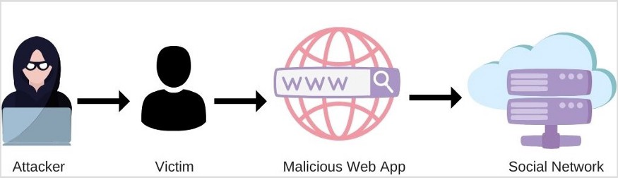

# 跨站请求伪造攻击及7种缓解策略

> 原文请查阅[这里](How JavaScript works: CSRF attacks + 7 mitigation strategies)，本文采用[知识共享署名 4.0 国际许可协议](http://creativecommons.org/licenses/by/4.0/)共享，BY [Troland](https://github.com/Troland)。

**这是 JavaScript 工作原理第二十二章。**

## 概述

跨站请求伪造（CSRF：Cross-site request forgery, 发音为“sea-surf”），也被称为 one-click attack 或者 session riding，通常缩写为 CSRF 或者 XSRF， 是 Web 应用程序或网页的一种恶意攻击方法。在这类型的攻击中，攻击者伪装成受害者执行恶意请求。 

恶意 Web 程序可以通过多种方式发起请求，例如特制图像标签，隐藏表单，AJAX 请求等。它们可以在用户不参与甚至不知情的情况下运行。

与[跨站脚本](https://blog.sessionstack.com/how-javascript-works-5-types-of-xss-attacks-tips-on-preventing-them-e6e28327748a)（XSS）相比，XSS 利用的是用户对特定网站的信任，CSRF 利用的是网站对用户网页浏览器的信任。

## 探索跨站请求伪造攻击

CSRF 攻击工作时，受害​​者会提交他们不知情的恶意请求。可能会导致在 Web 应用程序执行一些操作，包括客户端或服务器数据泄漏，会话状态的更改和操纵终端用户帐户等。

CSRF 攻击是针对浏览器的责任混淆攻击的一个例子，因为低权限的攻击者欺骗了浏览器从而提交伪造的请求。

CSRF 通常具有以下特征：

* 涉及依赖用户认证体系的网站或 Web 应用。
* 利用网站对该认证的信任。
* 欺骗用户浏览器向目标站点发送 HTTP 请求。
* 涉及存在副作用的 HTTP 请求。

跨站请求伪造攻击步骤如下：
* 受害者执行由攻击者控制的动作，例如访问网页，点击链接等。
* 此操作伪装成受害者的身份发送 HTTP 请求到 Web 应用。
* 如果受害者在 Web 应用上具有通过身份验证的活动会话，则该请求将作为合法请求进行处理。

重要的是，受害者与网络应用间必须保持有效会话，而该会话就是 CSRF 攻击的目标。

大多数情况下，CSRF 攻击并不会窃取私人信息，而是触发与受害者帐户相关的某种形式上的变更，例如修改凭据甚至进行购物行为。强迫受害者从服务器获取数据不会对攻击者产生受益，因为攻击方没有接收到服务端的响应。但受害人可以，正因如此，CSRF攻击的目标主要锁定在执行更改的请求上。

Web应用程序中的会话管理通常是基于cookie。每次向服务器发送请求时，浏览器都为请求携带上相关 Cookie，用于标识当前用户的会话。即使请求源来自其他 Web 应用和域，通常也会发生这种情况。这正是攻击者利用的漏洞。

尽管我们通常将 CSRF 描述为基于 cookie 会话相关处理，它也出现在应用程序自动向请求添加一些用户凭据等其他情况下，例如 HTTP [基本认证](https://en.wikipedia.org/wiki/Basic_access_authentication)和基于证书的认证。

### 例子

让我们看下面的示例，为社交网络应用上的一个简单的“个人资料页面”：

```html
<!DOCTYPE HTML>
<html>
<head>
<script src="https://ajax.googleapis.com/ajax/libs/jquery/3.5.1/jquery.min.js"></script>
<script>
$.get('htps://example.com/api/profile', function(data) {
    $('#username').val(data.name);
    $('#useremail').val(data.email);
});
</script>
</head>
  <body>
    <form method='post' action='htps://example.com/api/profile'>
      <fieldset>
        <legend>Your Profile:</legend>
        <label for='username'> Name:</label>
        <input name='username' id='username' type='text'> <br><br>

        <label for='email' > Email:</label>
        <input name='email' id='useremail' type='email'> <br><br>
        
        <button type='submit'> Update </button>
      </fieldset>
    </form>
  </body>
</html>

该页面只是简单从服务器加载用户配置文件数据，并填充到表单中。如果表单数据被编辑，则发送请求到服务器更新数据。

只有当前用户通过身份验证时，服务器才会接受提交的数据。

让我们看一下执行 CSRF 攻击的恶意页面。页面由攻击者创建，并且位于其他域上。该页面的目标是根据通过身份验证的受害者向社交网络应用发送请求：

```html
<!DOCTYPE HTML>
<html>
    <head></head>
    <body>
        <form method='post' action='htps://example.com/api/profile'>
            <input type='hidden' name='username' value="The Attacker">
            <input type='hidden' name='email' value="the@attacker.com">
        </form>

        <script>
              document.forms[0].submit();
        </script>
    </body>
</html>
```

该页面有一个带有隐藏字段的表单。其操作指向与社交网络的个人资料页面相同的端点。

一旦受害者打开了恶意网站，该表单就会通过页面脚本自动将数据提交至服务器。

当社交应用的用户未通过身份验证时表单没有危害。但如果用户通过了身份验证，则修改将被应用认为是合法请求。

由于浏览器上的 Cookie 跟踪了用户在社交网络上的会话。当易受攻击的 Web 程序收到更新请求时，由于它具有正确的会话 cookie，因此是合法的。



因此，即使攻击者无法直接访问到 Web 应用程序，也可以利用受害者和 CSRF 漏洞来执行未经授权的操作。实际上，与 XSS 攻击不同，攻击者在这里不会直接读取 cookie 并窃取。

此示例是一种过于简单和成熟的攻击，它可能更加复杂，受害者更不易察觉。例如，CSRF 攻击可以嵌入 iframe，且受害者根本不会意识到攻击的发生。

为了降低受到 CSRF 攻击的风险，下面是应遵守的一系列方法。

## 基于令牌的措施

这种防御措施是缓解CSRF攻击的最受欢迎和推荐的方法之一。可以通过两种方法来实现：

* 有状态—同步器令牌模式
* 无状态-基于加密或散列的令牌模式

许多流行框架提供了现成的实现技术。

### CSRF 内置实现

强烈建议开发者在尝试构建自定义系统前，先研究所使用的框架是否内置 CSRF 保护的选项。

即使有这样的系统，仍有一些配置需要开发者正确处理，例如密钥管理和令牌管理。

如果使用的框架中没有内置的 CSRF 保护机制，才考虑自己实现。

让我们看一下 `Express` 中的内置 CSRF 实现。`Express` 提供了一个名为 `csurf` 的中间件，仅此而已。

在本文中，我们不会讨论有关 `Express` 的知识或安装软件包的详细步骤。

这是我们的 `index.js` 文件：

```js
const express = require('express');
const bodyParser = require('body-parser');
const csrf = require('csurf')
const cookieParser = require('cookie-parser')
const app = express();
const csrfProtection = csrf({ cookie: true });

app.use(cookieParser());
app.use(bodyParser.urlencoded({ extended: true }));
app.set('view engine', 'ejs');

app.get('/', csrfProtection, (req, res) => {
  res.render('index', { csrfToken: req.csrfToken() });
});

app.post('/profile', csrfProtection, (req, res, next) => {
  res.send(req.body.name);
});

app.listen(3000);
```

然后在 `views` 目录下添加 `index.ejs`，如下所示：

```html
<form action='/profile' method='POST'>
  <input type='hidden' name='_csrf' value='<%= csrfToken  %>'>  
  <label for='name'> Name:</label> 
  <input type='text' name='name'>
  <button type='submit'> Update </button>
</form>
```

根路由将使用模板中的`csrfToken`变量来渲染`index.ejs`模板。在`index.ejs`中，`csrfToken`将被设置为隐藏字段的值。

提交表单后，请求将发送至受 CSRF 保护的`/profile`路由。如果没有令牌，将抛出无效的`CSRF`令牌错误。

### 同步器令牌模式

同步器令牌模式允许服务器验证请求并确保它们来自合法的源。该模式的工作原理是在服务器上为每个用户会话或每个请求生成令牌。

客户端发送请求时，服务器必须对比用户会话中的令牌并验证请求中令牌的存在和有效性。

大多数 Web 应用中，服务器使用 HTTP 会话对象来标识已登录用户。这种情况下服务器先生成会话，并将会话 ID 传递给客户端。该会话 ID 大部分时间都保存在客户端 Cookie 中。

每个请求生成令牌的方法更安全，因为攻击者有较少的时间来干扰和利用令牌。这种方法会降低用户体验。如果用户单击浏览器中的“后退”按钮，则上一页可能包含失效令牌。这意味着与上一页的交互将导致服务器无法验证令牌导致请求失败。

CSRF 令牌应具有以下特征：
* 每个会话具有唯一性
* 难以预测-安全生成的随机值

CSRF 令牌可以缓解 CSRF 攻击，如果没有令牌，攻击者将无法创建能在服务器上执行的有效请求。由于攻击者可能会拦截或访问 CSRF 令牌，因此请勿使用 Cookie 进行传输。


另外，也不建议通过 `GET`请求传输 CSRF 令牌，因为如果受保护的站点链接到外部站点，则可能会在多个位置泄漏，例如浏览器历史记录，日志文件，`Referrer headers` 等。

CSRF令牌应通过以下方式传输：

* 表单中使用的隐藏字段
* AJAX 请求头

将 CSRF 令牌添加到表单的方法如下：

```html
<form action='/api/payment' method='post'>
    <input type='hidden' name='CSRFToken' value='WfF1szMUHhiokx9AHFply5L2xAOfjRkE'>
</form>
```

与上面 `Express`示例类似，在服务器上生成作为输入字段值的令牌。

### 基于加密或散列的令牌模式

顾名思义，基于加密的令牌模式基于加密。对于现代 Web 应用，这是一种更合适的方法，程序在服务器上不维护任何状态。

令牌由服务器生成的，一般是由用户的会话 ID 和时间戳组成。这使用密钥对其加密。令牌生成后，将其返回给客户端。与同步令牌一样，基于加密的令牌既可以存储在隐藏字段中，也可以添加到 AJAX 请求头。

使用令牌发出请求后，服务器将尝试使用密钥对其进行解密。如果服务器无法解密令牌，则意味着存在某种形式的入侵，并且该请求被视为恶意或无效。

如果服务器成功解码，则将提取会话 ID 和时间戳。首先比较会话 ID 与当前经过身份验证的用户，并将时间戳与当前服务器时间进行比较，以确认其未超出预设到期时间。

如果会话 ID 与当前用户匹配，并且时间戳未过期，则该请求被视为安全请求。

## SameSite Cookie

Cookie 的 `SameSite` 属性用来限制第三方 Cookie，从而减少安全风险。

此属性使浏览器可以决定是否与跨站点请求一起发送cookie。可选值为：

* **Strict**- Cookies 仅在第一方上下文中发送，不会与第三方网站发起的请求一起发送。这意味着，如果某个网站上有指向 GitHub 私仓的链接，则单击链接后 GitHub不会收到会话 cookie，用户将无法访问该存储库。
* **Lax**- Cookies 不会通过CSRF倾向的请求方法（例如POST）发送。当用户导航到原始站点时，将发送 Cookie。如果在最近的浏览器版本中未明确指定 SameSite，则这是默认的 cookie 值。如果某个网站上有指向私有GitHub存储库的链接，则 GitHub将收到会话 cookie，且用户将能够访问该存储库。
* **None**-Cookies将在所有情况下（例如第一方请求和跨域请求）发送。此外，将需要 `secure flag`(SSL/HTTPS)。

所有台式机浏览器和绝大部分移动端浏览器都支持 SameSite 属性。

此属性不是用来完全替代 CSRF 令牌。相反，应该与令牌共存，以便以更可靠的方式保护用户。

## Origins 校验

此措施包括两个步骤，这些步骤依赖于检查 HTTP 请求头的值：

* 确定来源域 - 可以通过 `Origin` 或者 `Referer`头判断请求来自哪里。
* 确定目标域 - 请求发送至哪里。

服务器必须验证来源域和目标域是否匹配。如果存在匹配项，则该请求被视为合法并被接受。如果不匹配，由于跨域该请求将被丢弃。

可以默认这些头信息是可靠的，因为它们属于[禁止头信息](https://developer.mozilla.org/en-US/docs/Glossary/Forbidden_header_name)（只能由浏览器修改），无法通过 JavaScript 对其进行修改。

## 双重 Cookie 验证

双重 Cookie 验证是 CSRF 令牌的替代方法。这是一种无状态的方法。

当用户访问应用时，应生成加密强度高的伪随机值，并将其设置为用户计算机上的Cookie，与会话 ID 分开。

然后，服务器要求每个请求都包含该值（通过隐藏的表单或请求参数）。如果它们在服务器端都匹配，则服务器将其接受为合法请求，否则，服务器将拒绝该请求。

> 补充：作用较弱。任何可以设置 cookie 的攻击者都可以破解此方式（通过漏洞注入 cookie 或者中间人攻击 MitM）。

## 自定义请求头

这种方法非常适合于大量使用 AJAX 请求并依赖 API 訪問的 Web 应用程序。

此方法使用[同源策略](https://developer.mozilla.org/en-US/docs/Web/Security/Same-origin_policy)，该策略限制了仅 JavaScript 可以添加自定义头信息，并且只能在同源内使用。默认情况下，浏览器不允许 JavaScript 使用自定义请求头进行跨域请求。

此解决方案的效率性要求具有鲁棒性的 CORS 配置，因为来自其他域的自定义请求头会触发 CORS 预检查(用于获知服务端是否允许该跨源请求)。

这允许开发者向请求中添加自定义头信息，只需在服务器验证其存在和值即可。

该技术适用于 AJAX 请求，但`<form>`元素应另外由令牌保护。

## 基于交互的防御

用户行为是一种防止未授权操作非常有效的机制（例如 CSRF 攻击）。有两种常见的方法：
* 重验证-强制用户在执行请求之前进行验证
* [CAPTCHA](https://en.wikipedia.org/wiki/CAPTCHA)-验证码

尽管此类方法对 CSRF 攻击非常有效，但它们会对用户体验产生影响。它们应主要应用于汇款等关键业务。

## 预认证防御

即使在用户仍未通过身份验证的页面（例如登录页）上，也可能发生 CSRF 攻击。但攻击对预认证页面的影响是完全不同的。

假设现在有一个电子商务网站，受害者正以未验证状态在浏览商品。攻击者可以在该网站上使用 CSRF 攻击，以攻击者的帐户对受害者进行身份验证。当受害者输入信用卡信息时，攻击者将能够使用受害者的信用卡卡购买商品。

为了减少此类攻击，开发者可以在用户尚未通过身份验证时创建会话。遵循上面基于令牌的预防部分中提到的技术，登录表单必须包含 CSRF 令牌。

一旦用户通过身份验证，预会话应转换为真实会话。

## 参考资源
* <https://auth0.com/blog/cross-site-request-forgery-csrf/>
* <https://cheatsheetseries.owasp.org/cheatsheets/Cross-Site_Request_Forgery_Prevention_Cheat_Sheet.html#defense-in-depth-techniques>