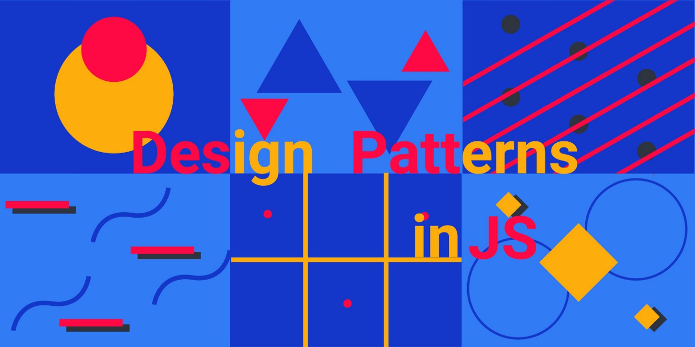

# 创建型/结构型/行为型设计模式及 4 种最佳实践

> 原文请查阅[这里](https://blog.sessionstack.com/how-javascript-works-creational-structural-and-behavioural-design-patterns-4-best-practices-2e8beeba744c)，略有删减，本文采用[知识共享署名 4.0 国际许可协议](http://creativecommons.org/licenses/by/4.0/)共享，BY [Troland](https://github.com/Troland)。

**这是 JavaScript 工作原理的第二十九章。**



设计模式通常是大多数开发者遇到的问题的标准化解决方案。这些问题很常见、已有记录，且已经被解决过，让其他软件工程师不必再担心解决方案。有人认为这些设计模式已成为行业标准的可重用架构。工程师都应该在提高语言能力的同时学习它们。

大多数学习设计模式的工程师都在寻找更好的方法来编写整洁且可维护的代码。研究这些模式可以让你成为更好的软件工程师，因为开发者会更理解框架是如何以及为什么被创建。大多数框架都是使用特定的设计模式构建，越了解设计模式，上手新框架的速度就越快。

设计模式可以在任何编程语言中被任何人使用。设计模式具有灵活性，这意味着开发者可以使用它们并扩展它们以满足自定义需求。记住，它们只是模式。

本文中将着使用 JavaScript 来探索这些设计模式，软件需要这些模式的原因，介绍并解释不同类型的设计模式，每个类别都附带描述示例。

顺便说一句，理解本文并不需要 JavaScript 知识，所有设计模式可以在任何其他特定语言使用。

## 什么是设计模式，为什么需要它们 ？

设计模式是针对常见问题的行业标准、良好的架构方法。可以将这些模式视为“模板”。使用任意设计模式能享受到的避免过度重复代码是一种解脱。

构建软件使用设计模式有以下几个原因：

- 有益于编写整洁且组织良好的代码。由于设计模式是行业标准且具有简洁的架构，基于此模式的代码更易于调试和维护。
- 解决熟悉的问题。尝试从头开始构建软件会各种出现问题，比如如何正确创建类、编写解耦代码、与对象交互甚至编写可重用代码。将来想要进行更改时，拥有良好解耦的代码将有助于防止中断和错误。这些是开发者经常面临的问题，且可以从特定设计模式找到很好解决这些问题的思路。
- 设计模式使用得当可以节省大量时间。由于它们是行业标准并解决了常见问题，因此开发时长会显着减少。

## 不同种类的设计模式

设计模式主要分为三大类。有一些其他类型但最常用的还是：创建型，结构型，行为型。

### 创建型设计模式

此模式的主要面向对象创建。它们为特定场景创建特定对象，对使用者只暴露接口，隐藏创建逻辑或类实现的细节。创建型设计模式可以细分为对象创建和类创建。

- 单例 Singleton
- 工厂方法 Factory
- 抽象工厂 Abstract Factory
- 生成者 Builder
- 原型 Prototype

这是创建型设计模式的五种著名模式，本小节研究单例模式并了解它的用例以及它在 JavaScript 中的工作原理。

#### 单例设计模式

单例确保负责创建对象的类只有一个实例。此类无需多次实例化就可以使用其对象。

对于单例人们会有过不少带有误解的争论，但它仍然是最容易实现的设计模式之一。其主要步骤是：

1. 单例类创建一个对象
2. 对象实例化
3. 防止应用程序中的其他地方创建另一个新实例
5. 将实例化的对象作为资源共享。

让我们直接进入代码环节。下面的例子实现足够简单和清晰，以便读者可以了解单例的要点。

第一步需要创建一个类，然后将其改造为单例。

Step 1: 创建一个工厂类。

```js
class Database {
  constructor() {
  	this.connectionURL = {
      	name: "",
        options: {}
    }
  }

  // connect 方法接收两个参数
  connect(name, options) {
  	this.connectionURL.name = name;
  	this.connectionURL.options = options;
        console.log(`DB: ${name} connected!`);
  }

  // disconnect 方法
  disconnect() {
    console.log(`${this.connectionURL.name} is disconnected!`);
  }
}

// 类实例化
const db = new Database()
console.log(db.connect("Facebook"))
```

Step 2: 实例化后让属性变为不允许修改的状态。

```js
class Database {
  constructor() {
  	this.connectionURL = {
      	name: "",
        options: {}
    }
    
    // 实例化不允许修改类
    Object.freeze(this);
  }

  connect(name, options) {
  	this.connectionURL.name = name;
  	this.connectionURL.options = options;
        console.log(`DB: ${name} connected!`);
  }

  disconnect() {
    console.log(`${this.connectionURL.name} is disconnected!`);
  }
}

const db = new Database();
console.log(db.connect("Facebook"));
```

上面代码中，实例化后不再允许添加或更改属性。在其他语言（如 Java）中将会创建一个 `getInstance()` 方法用于访问 Singleton 实例。在 JavaScript 中执行同样的操作区别在于使用 `constructor()` 而不是 `getInstance()` 方法。

Step 3. `Database` 成为自身的实例并添加类是否已经被实例化的检查。

```js
class Database {
  constructor() {
    // 查看实例是否已经创建
    if (Database.instance instanceof Database) {
        return Database.instance;   
    }
  	this.connectionURL = {
      	name: "",
        options: {}
    }
    
    Object.freeze(this);
    
    // 使类成为自身一个实例
    Database.instance = this;
  }

  connect(name, options) {
  	this.connectionURL.name = name;
  	this.connectionURL.options = options;
        console.log(`DB: ${name} connected!`);
  }

  disconnect() {
    console.log(`${this.connectionURL.name} is disconnected!`);
  }
}

const db = new Database();
console.log(db.connect("Facebook"));
```

```js
if (Database.instance instanceof Database) {
   return Database.instance;   
}
```

上面代码中，每次创建实例都会立即检查类是否存在着之前创建的实例，如果有，则返回该实例。这一点就是来保证使用者不能创建多个实例。

可以通过创建两个实例来进一步验证两者是否相同：

```js
const db1 = new Database()

const db2 = new Database()

console.log(db1 === db2)
// true
```

使用单例模式后尝试创建另一个实例是不可能的。这就是为什么两个实例比较的结果返回 `true`。

单例模式的缺点：
- 竞争冒险。当多组件或多线程尝试访问单例中的此共享资源时，会遇到可能无法正确读取数据的问题。该模式在多线程环境下需要进行特殊处理，避免多个线程多次创建单例对象。
- 单例的客户端代码单元测试可能会比较困难，因为许多测试框架以基于继承的方式创建模拟对象。由于单例类的构造函数是私有的，而且绝大部分语言无法重写静态方法，所以你需要想出仔细考虑模拟单例的方法。要么干脆不编写测试代码，或者不使用单例模式。

### 结构型设计模式

此设计模式用于处理实体间的关系。主要处理类和对象的组合，这意味着特定对象将在另一个类中被使用，从而提供新功能。不要忘记这种关系与[继承](polymorphism.md)有关，其中类继承现有类的成员。两个主要关键词是组合和继承。

总之这是创建类并找到关联它们或使用组合建立关系的方法。使用这种方法的设计模式有：

- 适配器 Adapter
- 外观 Facade
- 桥接 Bridge
- 代理 Proxy
- 享元 Flyweight

为了提供更详细的说明，下面基于适配器模式的用例来了解在 JavaScript 中的工作原理。

#### 适配器设计模式

适配器作为两个互不兼容的类间的契约或桥梁。我喜欢将此模式作为包装器，因为它包装了两个单独接口（比如两个类被连接在一起）并将它们连接在一起。

让我们以 APIs 为例。我们创建了一个 API 充当两个类之间的桥梁。就像生活中人们可以使用插座来适配各种不兼容连接到墙上插座的的插头。 API 或桥接器就是适配器模式。第三方库就是很好的例子。

由于适配器模式与外观模式等其他模式有相似之处，毫无疑问它们容易让人混淆。

```js
import { first, middle, last } from "random-name";

class randomName {
  generateFirstName() {
    return first();
  }
  
  generateMiddleName() {
    return middle();
  }
  
  generateLastName() {
    return last();
  }
}

export default new randomName();
```

上面实例代码就是一个适配器，理论上可以使用想要的任何库，例子中的是 `randomName`。接着在下面代码中使用这个适配器：

```js
import name from "./random-name";

class PlugComponent {
  constructor() {
    this.firstName = name.generateFirstName();
    this.middleName = name.generateMiddleName();
    this.lastName = name.generateLastName();
  }
  
  generateFullName() {
    return `${this.firstName} ${this.middleName} ${this.lastName}`
  }
}

const names = new PlugComponent()
console.log(names.generateFullName()) // Victor Victor Jonah
```

这种模式通常有助于提高代码复用性和灵活性。当开发者倾向使用过多适配器时可能会出现大问题。

### 行为型设计模式

此模式关注对象之间的通信。它们为开发者提供了解耦和灵活代码的对象通信解决方案。

总之每当需要处理对象之间的通信时都应该选择此类别。使用这种通信方法的模式有：

- 责任链 Chain of Responsibility
- 命令 Command
- 解释器 Interpreter
- 观察者 Observer
- 空对象 Null object

要了解有关此类别的更多信息，让我们来看看空对象设计模式。

#### 空对象设计模式

这种模式帮助开发者避免在代码中返回 null 值。需要明确的是，该模式封装了 null 的行为并返回客户端期望的期望结果。大多数时候 null 引用是不被允许的，这也就是必须进行 null 检查的原因。空检查可以让代码里的 if/else 语句杂乱无章。只需将空对象添加到项目中，它有助于保持客户端的代码的整洁度，因为开发者不再需要添加逻辑来检查空值。

当不想向客户端返回空值时，空对象模式很有效，因为它封装了我们期望的逻辑。这是我最常用的模式用来捕获特定的异常。

下面来看看如何在 JavaScript 中使用这种模式处理 null 值：

```js
class Cat {
  sound() {
    return 'meoow';
  }
}

class NullAnimal {
  sound() {
    return "not an animal";
  }
}

const getAnimal = (type) => {
  return type === 'cat' ? new Cat() : new NullAnimal();
}

const results = ['cat', null]; 

const response = results.map((animal) => getAnimal(animal).sound());
// ["meoow", "not an animal"]
```

示例不使用空引用，而是使用对象将预期结果返回给客户端。通过避免客户端编写空检查来简化代码。

### 设计模式最佳实践

看过了设计模式的类别和每个类别的几个示例，开发者可能会想它们是否可以在代码被使用。设计模式也有最佳实践，每个软件工程师都必须了解这些最佳实践：

- 设计先行：在编码前必须采取的第一个实践。开工前点设计提供了更好的优势。
- 保持简单愚蠢(KISS)：如果你不能解释它，它就不简单。设计模式的目的是使代码简单易懂。
- 不要重复自己(DRY)：使方法具有可重用性，将它们分解或分组而不是到处重写相同的方法。
- 关注点分离：每个服务都必须分以便哪里调试。单独的子程序应具有单一原则。

这些是在代码中使用设计模式时遵循的一些最佳实践。

通常，一个项目会使用多种模式，但没有必须选择哪些模式的黄金法则。项目需求定义了模式的选择。

## 结论

本文主要介绍了设计模式及为什么开发者需要设计模式的原因。设计模式主要分为三类创建型，结构型和行为型，就三大模式的各一子类单例、适配器和空对象提供了代码示例。 

创建型模式侧重于对象的创建，结构型模式依赖对象之间的关系，而行为型模式侧重于对象间的通信的建立。

这些模式能帮助开发者写出更好、更整洁的架构，这正是研究设计模式的主要原因。

建议编程新手在更精通所使用的编程语言前无需过度关注设计模式。

> 本文仅详细介绍了三大设计模式中的各一种子类，这里推荐一个图文并茂的设计模式介绍网站 [refactoringguru](https://refactoringguru.cn/design-patterns)。


