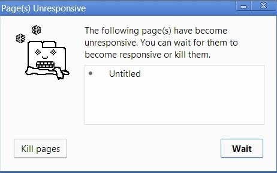
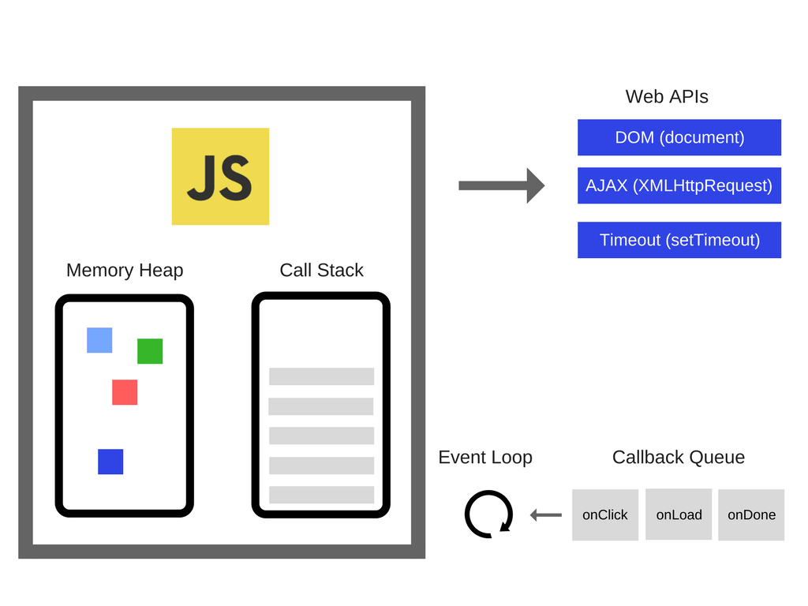

# 事件循环及异步编程的出现和 5 种更好的 async/await 编程方式

> 原文请查阅[这里](https://blog.sessionstack.com/how-javascript-works-event-loop-and-the-rise-of-async-programming-5-ways-to-better-coding-with-2f077c4438b5)

**这是  JavaScript 工作原理的第四章，原文略有删减。**

现在，我们将会展开第一篇文章来回顾下单线程环境编程的缺点及如何克服这些困难以创建令人惊叹的 JavaScript 交互界面。老规矩，我们将会在本章末尾分享 5 条利用 async/await 编写更简洁代码的小技巧。

## 单线程的局限性

在第一篇文章开头，我们抛出了一个问题即调用栈中含有需要消耗大量的时间以完成运行的函数调用的时候会发生什么。

譬如，试想下，在浏览器中运行着一个复杂的图片转化算法。

恰好此时调用栈中有函数需要执行，浏览器将会被阻塞，它不能够做其它任何事情。这意味着，浏览器不能够进行渲染，不能够运行其它代码，它卡住了。这将会带来些问题即－你的 app 交互将不再高效和令人愉悦。

你的程序卡住了。

在某些情况下，这或许没什么大不了的。但是可能会造成更加严重的问题。一旦，浏览器在调用栈中同时运行太多的任务的时候，浏览器会很长时间停止响应。到了那个时候，大多数浏览器会抛出一个错误，询问你是否关闭网页。

这很丑陋且它完全摧毁了程序的体验交互。



## JavaScript 的构建模块

你可能会在单一的 .js 文件中书写你的 JavaScript 程序，但是你的程序是由多个模块组成的，当前只有一个模块在运行，其它模块将在随后运行。最常见的模块单元是函数。

大多数 JavaScript 菜鸟需要理解的问题即之后运行的代码表示的是并不是严格意义上且马上在现在之后执行。换句话说即，根据定义，现在不能够运行完成的任务将会异步完成，这样你将不会不经意间地遇到以上提及的 UI 阻塞行为。

看下如下代码：

```
// ajax 为一个库提供的任意 ajax 函数
var response = ajax('https://example.com/api');

console.log(response);
// `response` 将不会有数据返回
```

你可能知晓，标准的 ajax 请求不会完全同步执行完毕，意即在代码运行阶段，ajax(..) 函数不会返回任何值给 response 变量。

使用回调函数是获得一个异步函数返回值的一个简单方法。

```
ajax('https://example.com/api', function(response) {
    console.log(response); // `response` is now available
});
```

只是要注意：永远不要发起同步 ajax 请求。如果发起同步 ajax 请求，JavaScript 程序的 UI 将会被阻塞－用户不能够点击，输入数据，跳转或者滚动。这将会冻结任何用户交互体验。这是非常糟糕。

以下示例代码，但这会毁掉网页：

```
// 假设你使用 jQuery
jQuery.ajax({
    url: 'https://api.example.com/endpoint',
    success: function(response) {
        // 成功回调.
    },
    async: false // 同步
});
```

我们使用 Ajax 请求作为示例。你可以异步执行任意代码。

你可以使用 `setTimeout(callback, milliseconds)` 来异步执行代码。`setTimeout` 函数即会在之后的某个时刻运行事件。如下：

```
function first() {
    console.log('first');
}
function second() {
    console.log('second');
}
function third() {
    console.log('third');
}
first();
setTimeout(second, 1000); // 1 秒后调用 second 函数
third();
```

控制台输出如下：

```
first
third
second
```

## 事件循环

我们将会开始一个老问题－尽管允许异步执行代码(比如之前讨论的 `setTimetout`)，但是直到 ES6，实际上 JavaScript 本身并没有集成任何直接的异步编程概念。JavaScript 除了允许在任意时刻执行单一程序片段以外，啥也没干。

可以查看之前的[文章](./overview.md)来了解 JavaScript 引擎的工作原理。

那么，是谁告知 JS 引擎来执行程序代码的呢？实际上，JS 引擎并不是单独执行的－它运行在一个宿主环境中，对大多数开发者来说是 web 浏览器或者 Node.js。现在，在现实生活中，JavaScript 被集成进从机器到灯泡的各种设备之中。每个设备代表了 JS 引擎的不同宿主环境。

所有宿主环境中的常见的是一个被称为事件循环的内置机制，事件循环会循环处理程序中多个代码片段的执行，每次都会调用引擎。

这意味着 JS 引擎只是任意 JS 代码执行的按需执行环境。这是一个封闭的环境，在之中调度事件(运行JS 代码)。

所以，打个比方，当你的 JavaScript 程序发起 Ajax 请求来从服务器获得数据，你在回调函数中传入 "response" 参数，JS 引擎会告诉宿主环境：

"嘿，我现在要挂起执行了，现在当你完成网络请求的时候且返回了数据，请执行回调函数。"

浏览器会监听网络中的数据返回，而有数据返回的时候，它会调度回调函数，把它插入事件循环中执行。

让我们看下如下图表：



你可以在之前的[文章](./overview.md)中阅读更多关于动态内存管理和调用栈的信息。

这些网页 API 是啥？本质上，它们是你不能够访问的线程，你只能够调用它们。它们是浏览器自带的，包括并发 API。如果你是个 Node.js 开发者，这些是 C++ api。

说了那么多，事件循环到底是啥？


事件只有一个简单的任务－监测调用栈和回调队列。如果调用栈是宽的，它会从回调序列中取得第一个事件然后入栈，在调用栈中执行该事件。

在事件循环中这一遍历被称为一个 tick。每个事件就是一个回调函数。

```
console.log('Hi');
setTimeout(function cb1() { 
    console.log('cb1');
}, 5000);
console.log('Bye');
```

让我们执行这段代码，然后看看会发生什么：

1. 空状态。浏览器控制台是空的，调用栈也是空的。

   2.`console.log('Hi')` 被压入调用栈中。

   

   3.执行 `console.log('Hi')`。

   

   4.从调用栈中移除 `console.log('Hi')`

   

   5. 把 `setTimeout(function cb1() { ... })` 压入调用栈中

   6. 执行 `setTimeout(function cb1() { ... })`，浏览器

      ​

   ​