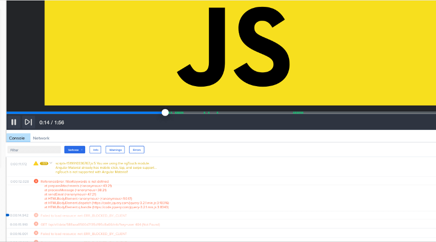

# 异常及同步/异步代码异常处理最佳实践

> Contributors: [@Chkaos](https://github.com/chkaos)
>
> 原文请查阅[这里](https://blog.sessionstack.com/how-javascript-works-exceptions-best-practices-for-synchronous-and-asynchronous-environments-39f66b59f012)，本文采用[知识共享署名 4.0 国际许可协议](http://creativecommons.org/licenses/by/4.0/)共享，BY [Troland](https://github.com/Troland)。

**这是 JavaScript 工作原理的第二十章。**



## 概述
在计算中，错误检测是一种在程序执行过程中实现可靠流的技术。

错误检测的一种方法是错误检查。此方法通过一连串的显式检查异常来维护正常的程序流，使用特定的返回值，辅助全局变量或浮点状态标志来报告异常。

异常指的是在程序运行过程中发生的影响程序流的异常事件。这种中断会触发预注册的异常处理程序的执行。

在软件和硬件层上都可能发生异常。

## JavaScript 中的异常
一个 JavaScript 应用程序有可能在不同的操作系统，浏览器+插件和设备上运行。无论开发者编写了多少测试，这种不确定性性的环境最终都很有可能会导致错误。

从最终使用者的角度上看，JavaScript 只是通过静默失败来处理错误。但底层的处理机制其实比想象中复杂。

A JavaScript code throws an exception when a particular statement generates an error. Instead of executing the next code statement, the JavaScript engine checks for the existence of exception handling code.

当特定语句生成错误时，JavaScript 代码将引发异常。[JavaScript 引擎](https://blog.sessionstack.com/how-javascript-works-inside-the-v8-engine-5-tips-on-how-to-write-optimized-code-ac089e62b12e)将检查是否存在异常处理代码，而不是执行下一个代码语句。

如果未定义异常处理程序，则引擎从抛出异常的函数返回。对于调用栈上的每个函数会重复执行此过程直到发现异常处理程序为止。如果调用栈上已经没有函数时仍未找到异常处理程序，那么事件循环会将回调队列上的下一个函数推入栈中。

异常发生时，将创建并抛出一个错误对象(`Error Object`)。

## 错误对象的种类
JavaScript中有九种类型的内置错误对象，它们是异常处理的基础：
* **Error** - 表示通用异常, 最常用于实现用户自定义异常。
* **EvalError** - `eval()` 函数使用不当时发生。
* **RangeError** - 用于数值型变量或参数超出其有效范围时发生的错误。
* **ReferenceError** - 当访问不存在的变量时发生的引用异常。
* **SyntaxError** - 语法异常。JavaScript 语法规则被破坏时发生。对于静态类型的语言，会在编译时发生。而在 JavaScript中，此异常发生在运行时。
* **TypeError** - 当值与预期类型不匹配时发生。调用不存在的对象方法是此类异常的常见原因。
* **URIError** - 当 `encodeURI()` 和 `decodeURI()` 遇到格式错误的URI时发生。。
* **AggregateError** - 当多个错误​​需要包装在一个错误中时，该对象表示一个错误。比如 `Promise.any()`。
* **InternalError** - 在 JavaScript 引擎中引发内部错误时发生。比如太多的递归导致栈溢出。在撰写本文时，此[API](https://developer.mozilla.org/zh-CN/docs/Web/JavaScript/Reference/Global_Objects/InternalError)尚未标准化。

开发者可以通过继承一些内置错误类型来定义自定义错误类型。

## 异常抛出

JavaScript 允许开发者通过 throw 语句主动抛出异常。

```js
if (denominator === 0) {
    throw new RangeError("Attempted division by zero");
}
```
所有内置错误对象都有一个可选的 `message`参数，用于提供了人类可读的错误描述。

注意: 可以抛出任何类型的对象作为异常，例如数字，字符串，数组等。

```js
throw true;
throw 113;
throw 'error message';
throw null;
throw undefined;
throw {x: 1};
throw new SyntaxError('hard to debug');
```

以上都属于有效的 JavaScript 语句。

## 异常处理

现在，我们将了解如何确保异常不会使应用程序崩溃。

### try 子句

和其他编程语言一样, JavaScript有 `try`，`catch`，`finally`语句，使开发者可以控制代码中的异常流。

举个例子：

```js
try {
    // a function that potentially throws an error
    someFunction();
} catch (err) {
    // this code handles exceptions
    console.log(e.message);
} finally {
    // this code will always be executed
    console.log(finally’);
}
```
`try` 语句是强制性的，并包含着可能引发错误的代码块。

### catch 子句
它后面紧跟着的 `catch`块包装了处理错误的 JavaScript 代码。

`catch`子句阻止异常在调用栈中传播，并允许应用程序流继续进行。错误本身作为参数传递给`catch`子句。

通常，某些代码块会引发不同种类的异常，并且应用程序应该会根据异常的不同采取不同的处理。

JavaScript 的 `instanceof` 运算符，可用于区分异常类型：

```js
try {
  If (typeof x !== ‘number’) {
       throw new TypeError(‘x is not a number’);
  } else if (x <= 0) {
       throw new RangeError(‘x should be greater than 0’);
  } else {
       // Do something useful
  }
} catch (err) {
    if (err instanceof TypeError) {
      // Handle TypeError exceptions
    } else if (err instanceof RangeError) {
      // Handle RangeError exceptions
  } else {
      // Handle all other types of exceptions
  }
}
```

一种有效使用场景是重新抛出已捕获的异常。例如在上下文中捕获到类型无关紧要的。

### finally 子句

无论最终是否有异常，都会在`try`和`catch`子句之后执行`finally`代码块。`finally`对于包含清理代码（例如关闭WebSocket连接或其他资源）的执行非常有帮助。

请注意，即使未捕获到抛出的异常，finally 块也会执行。然后引擎继续按顺序遍历调用栈中的函数，直到正确处理异常或应用程序被终止。

还要注意的另外一点是，即使`try`或`catch`块执行了`return`语句，也会执行`finally`块。

请看下面的例子：

```js
function foo1() {
    try {
        return true;      
    } finally {
        return false;
    }
} 
```
通过调用`foo1()`函数，即使`try`块具有`return`语句，我们也会得到`false`。

如果在`catch`块中有`return`语句，此规则同样适用：

```js
function foo2() {
    try {
        throw new Error();      
    } catch {
        return true;
    } finally {
        return false;
    }
} 
```

调用`foo2()`函数, 同样会返回`false`。

## 异步代码的异常处理

我们在这不再赘述[异步编程](https://blog.sessionstack.com/how-javascript-works-event-loop-and-the-rise-of-async-programming-5-ways-to-better-coding-with-2f077c4438b5), 但我们将介绍如何通过回调函数，`Promise` 和 `async/await` 来处理异常。

### async/await

首先我们来定义一个抛出异常的异步函数。

```js
async function foo() {
    throw new Error();
}
```

当在异步函数中抛出错误时，将与异常一起返回一个已拒绝的`promise`，等同于：
```js
return Promise.Reject(new Error())
```

让我们看看调用`foo()`时会发生什么：

```js
try {
    foo();
} catch(err) {
    // This block won’t be reached.
} finally {
    // This block will be reached before the Promise is rejected.
}
```

由于`foo()`是异步的，因此将触发`Promise`。该代码不等待异步函数，因此此时并没有任何实际异常被捕获。随后`finally`块执行，然后`Promise`拒绝。

此时的我们没有任何代码处理被拒绝的`Promise`。

可以通过在调用`foo()`时添加`await`关键字并将代码囊括在异步函数中来解决：

```js
async function run() {
    try {
        await foo();
    } catch(err) {
        // This block will be reached now.
    } finally {
        // This block will be reached at the end.
    }
}
 run();
```

### Promises

让我们定义一个在`Promise`之外引发错误的函数。

```js
function foo(x) {
    if (typeof x !== 'number') {
        throw new TypeError('x is not a number');
    }

    return new Promise((resolve, reject) => {
        resolve(x);
    });
}
```
现在，我们使用字符串作为参数来调用`foo()`而不是数字：

```js
foo('test')
    .then(x => console.log(x))
    .catch(err => console.log(err));
```

由于`Promise` 无法捕获到`Promise`之外引发的异常，所以这会产生` Uncaught TypeError: x is not a number `的报错。

要捕获此类错误，需要使用标准的`try`和`catch`子句：

```js
try {
    foo('test')
    .then(x => console.log(x))
    .catch(err => console.log(err));
} catch(err) {
    // Now the error is handed
}
```
如果将`foo`修改为在`Promise`中抛出错误：

```js
function foo(x) {
    return new Promise((resolve, reject) => {
       if (typeof x !== 'number') {
            throw new TypeError('x is not a number');
       }
        resolve(x);
    });
}
```

这样`Promise`里的`catch`语句也是能正确处理异常的。

```js
try {
    foo(‘test’)
    .then(x => console.log(x))
    .catch(err => console.log(err)); // The error is handled here.
} catch(err) {
    // This block is not reached since the thrown error is inside of a Promise.
}
```

要注意的是在`Promise`中抛出错误与使用`reject`回调相同。因此最好这样定义`foo`：

```js
function foo(x) {
    return new Promise((resolve, reject) => {
       if (typeof x !== 'number') {
            reject('x is not a number');
       }
        resolve(x);
    });
}
```

如果`Promise`中没有`catch`方法来处理错误，则回调队列中的下一个函数将添加到栈中。

### 回调函数

使用错误优先回调方法有两个主要规则：

1. 回调的第一个参数用于错误对象。如果发生错误，它将由第一个err参数返回。如果未发生错误，则err将设置为null。
2. 回调的第二个参数为结果, 即响应数据。

```js
function asyncFoo(x, callback) {
    // Some async code...
}

asyncFoo(‘testParam’, (err, result) => {
    If (err) {
        // Handle error.
    }
    // Do some other work.
});
```
如果有错误对象，最好不要去动结果参数。

## 处理未处理的异常

如果应用程序使用了第三方库，则无法控制它们如何处理异常。在某些情况下，您可能希望能够处理未处理到的异常。

### 浏览器

浏览器暴露了一个`window.onerror`的事件处理器可用于此。

使用方法如下：

```js
window.onerror = (msg, url, line, column, err) => {
     // ... handle error …
     return false;
};
```
参数：
* **msg**-与错误相关的信息，例如`Uncaught ReferenceError: foo is not defined`。
* **url**-与错误关联的脚本或文档的地址。
* **lineNo**-行号（如果存在的话）。
* **columnNo**-列号（如果存在的话）。
* **msg**-与错误相关的`Error`对象（如果存在的话）。

当函数返回`true`时，这将防止触发默认事件处理程序。

注意只能将一个事件处理程序分配给`window.onerror`，因为这是函数分配，一次只能将一个函数分配给一个事件。

这意味着，如果您分配自己的`window.onerror`，则将覆盖第三方库可能分配的所有以前的处理程序。这可能是一个巨大的问题，尤其是对于错误跟踪器之类的工具而言，因为它们很可能会完全停止工作。

开发者可以使用以下技巧轻松解决此问题。

```js
var oldOnErrorHandler = window.onerror;
window.onerror = (msg, url, line, column, err) => {
    If (oldOnErrorHandler) {
        // Call any previously assigned handler.   
	oldOnErrorHandler.apply(this, arguments);
    }

    // The rest of your code
}
```

上面的代码检查是否存在先前定义的`window.onerror`，并在继续操作之前简单地调用它。使用此模式，您可以继续添加其他处理程序。

这种方法在浏览器间高度兼容（即使是IE6）。

另一种不需要替换异常处理程序的方法是将事件侦听器添加到`window`对象：
```js
window.addEventListener('error', e => { 
    // Get the error properties from the error event object 
    const { message, filename, lineno, colno, error } = e; 
});
```
这种方法要好得多，并且从IE9开始得到了广泛支持。

### Node.js

`Event Emmiter`模块中的`process `对象提供了两个用于处理错误的事件。
1. **uncaughtException** : 当未捕获的异常一直冒泡至事件循环时触发。

默认情况下，`Node.js`通过将堆栈跟踪打印到`stderr`并使用`code 1`退出来处理此类异常。

为此事件添加处理程序将覆盖默认行为。该事件的正确用法是在关闭进程之前执行分配资源的同步清理（例如文件描述符，句柄等）。此后恢复正常运行的行为是不安全的。

2. **unhandledRejection** : 每当`Promise`被拒绝且在事件循环内没有错误处理程序附加到`Promise`时触发。

`unhandledRejection`事件对于检测和跟踪已拒绝的`Promise`以及尚未处理的`reject`很有用。

```js
process
    .on('unhandledRejection', (reason, promise) => {
         // Handle failed Promise
    })
    .on('uncaughtException', err => {
        // Handle failed Error   
        process.exit(1);
     });
```
在代码中妥善处理错误，这一点非常重要。了解未处理的错误同样重要，这样就可以确定优先级并相应地进行处理。

## 参考资源:
* https://www.sitepoint.com/exceptional-exception-handling-in-javascript/#:~:text=When%20a%20JavaScript%20statement%20generates,whatever%20function%20threw%20the%20exception.
* https://www.tutorialspoint.com/es6/es6_error_handling.htm
* https://www.javascripttutorial.net/es6/promise-error-handling/