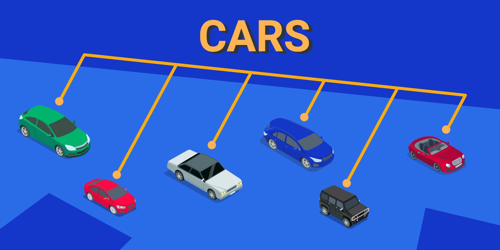
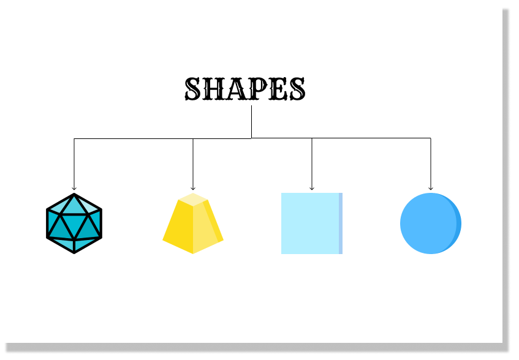

# 3 种多态

> 原文请查阅[这里](https://blog.sessionstack.com/how-javascript-works-3-types-of-polymorphism-f10ff4992be1)，略有删减，本文采用[知识共享署名 4.0 国际许可协议](http://creativecommons.org/licenses/by/4.0/)共享，BY [Troland](https://github.com/Troland)。

**这是 JavaScript 工作原理的第二十六章。**



现实生活中，一个女人同时拥有不同的角色。她可以同时是母亲，雇员和妻子。她可以根据当前角色执行不同职能。这就是多态的概念，可以根据不同实例执行不同操作。

尽管很多人不清楚什么是多态，它在 JavaScript 中的工作原理以及其使用场景，但多态在编程中很重要；它是面向对象编程的核心特性。举个例子，当女性的角色是公司雇员时，她不太可能表现出在家中母亲的特征，反之亦然。

对于 Rust 这样的面向数据的语言，多态也是基于实体组件系统（ECS）实现的重要特性。编程语言可以为几种不同的基础数据类型提供相同的接口。用 JavaScript 编写程序可以采用不同的形式。在本文中，我们将探讨什么是多态，如何将其应用于 JavaScript ，不同类型的多态以及在使用多态时的注意事项。

## 什么是多态

假设我们需要编写一个程序来计算形状的面积和周长。为此，我们需要定义一些方法来计算形状的面积和周长 - `area()` 和 `perimeter()`。但基本几何学知识告诉我们，我们无法用相同的方式求解不同形状的面积和周长。例如，圆的周长是 `2 x Pi x 半径`，而正方形的周长是 `4 x Length`。

因此我们需要将不同的形状定义为基类 `shape` 的子类或派生类。所以将有一个圆形 `circle`，正方形 `square`，梯形 `trapezium`，多边形 `polygon` 的子类，它们有各自的方法和不同的参数。上面的例子正是多态。现在 `shape` 类具有不同的形态和特征 - 圆形，正方形，梯形和多边形。

多态是从两个词衍生而来 - poly 和 morphism 表示形式的多样。在编程中，多态被定义为一个对象采取不同形式的能力。在下一节，我们将深入了解 JavaScript 如何处理多态。

## JavaScript 如何处理多态

编程语言实现多态的方式不同。例如 Java 和 JavaScript(语法糖) 都是面向对象的语言，但它们处理多态的方式不同。尽管多态性是面向对象编程语言的核心功能，但是某些面向数据的语言通过实体组件系统（ECS）模式实现了多态。我们还将研究多态如何与继承和封装一起使用。

### 多态和面向对象编程

要了解多态在面向对象程序设计中的工作原理，最好先了解面向对象模型的概念。面向对象模型依赖于对象和类的概念。这种类型的模型可以使用 `this` 或 `self` 的概念来改变其数据字段。

尽管这不在本文讨论范围内，但我将通过比较面向对象模型中的多态（作为接口）和面向数据编程中的多态（作为实体组件系统）来说明 JavaScript 中多态是如何工作的。

在面向对象中，我们可以创建一个类，使用以下代码块来计算不同形状的面积和周长：



```js
class Shape {
  area() {
    return 0;
  }
  perimeter() {
    return 0;
  }
  toString() {
    return Object.getPrototypeOf(this).constructor.name;
  }
}

class Circle extends Shape {
  constructor(r) {
    super();
    this.radius = r;
  }

  area() {
    return Math.PI * this.radius ** 2;
  }

  perimeter() {
    return Math.PI * this.radius * 2;
  }
}

class Rectangle extends Shape {
  constructor(w, h) {
    super();
    this.width = w;
    this.height = h;
  }

  area() {
    return this.width * this.height;
  }
  perimeter() {
    return 2 * (this.width + this.height);
  }
}

function cumulateShapes(shapes) {
  return shapes.reduce((sum, shape) => {
    if (shape instanceof Shape) {
      console.log(`Shape: ${shape.toString()} - area: ${shape.area()}`);
      console.log(
        `Shape: ${shape.toString()} - perimeter: ${shape.perimeter()}`
      );
      return sum + shape.area();
    }
    throw Error("Bad argument shape.");
  }, 0);
}

const shapes = [new Circle(3), new Rectangle(2, 3)];

console.log(cumulateShapes(shapes));

// Shape: Circle - area: 28.274333882308138
// Shape: Circle - perimter: 18.84955592153876
// Shape: Rectangle - area: 6
// Shape: Rectangle - perimter: 10
```

我们可以使用面向数据语言的伪代码从上面的代码中使用 ECS 重新创建程序。

```Rust
var Position;
var Circle;
var Rectangle;

class CirlceSystem extends Position {
  OnUpdate() {
    ComponentQuery.SelectReadOnly(typeof Position, typeof Circle).ForEachEntity(
      (Entity, Position, Circle) => {
        /* find area and perimeter */
      }
    );
  }
}

class RectangleSystem extends Position {
  OnUpdate() {
    ComponentQuery.SelectReadOnly(
      typeof Position,
      typeof Rectangle
    ).ForEachEntity((entity, Position, Rectangle) => {
      /* find area and perimeter */
    });
  }
}
```

两个例子的区别在于，在 JavaScript 代码的面向对象编程中，使用了接口/抽象的方式进行深度继承。但在面向数据编程的伪代码中我们使用 ECS 模型将实体分离为组件便于数据检索。

接下来让我们更好地理解什么是 JavaScript 中的继承以及它与多态的关系。

### 多态与继承

继承是面向对象编程中多态性的重要特性。让我们看一个 `car` 对象的例子:

```js
class Car {
  constructor(color, speed) {
    this._speed = speed;
    this._color = color;
  }
}
```
现在汽车对象将针对不同的汽车制造商（例如宝马，丰田，宾利等）创建不同的子类，以及不同的属性（例如颜色和速度）：

```js
class BMW extends Car {
  constructor(color, speed, make) {
    super(color, speed);
    this._make = make;
  }

  showInfo() {
    console.log(
      "I’m " +
        this._make +
        ", my color is " +
        this._color +
        ", and my speed is " +
        this._speed
    );
  }
}

class Toyota extends Car {
  constructor(color, speed, make) {
    super(color, speed);
    this._make = make;
  }

  showInfo() {
    console.log(
      "I’m " +
        this._make +
        ", my color is " +
        this._color +
        ", and my speed is " +
        this._speed
    );
  }
}

class Bentely extends Car {
  constructor(color, speed, make) {
    super(color, speed);
    this._make = make;
  }

  showInfo() {
    console.log(
      "I’m " +
        this._make +
        ", my color is " +
        this._color +
        ", and my speed is " +
        this._speed
    );
  }
}
```

接下来，我们为不同车型输入颜色，速度并打印信息。

```js
var myBentely = new Bentely('Red', '20mph', 'Bentely');
var myBMW = new BMW('Green', '40mph', 'BMW');
var myToyota = new Toyota('White', '60mph', 'Toyota');
console.log(myBentely.showInfo()); 
console.log(myBMW.showInfo());  
console.log(myToyota.showInfo());
```

在示例中，子类可以使用超类的属性来对其进行定义。继承可以从当前家庭追溯到祖父母甚至曾祖父母。

### JavaScript 中不同类型的继承

继承是 JavaScript 中一个非常广泛的主题，因为其实现方式有多种 - 如原型，伪类和函数式继承。让我们简要看一下它们的不同之处，以及如何与 JavaScript 多态一起使用。

1. 原型继承

原型继承是一种继承类型，它向现有对象添加新的属性和方法。这种继承利用了原型对象，即 `object.prototype`。

```js
let Car = {
  color: "Red",
};
let BMW = {
  make: "BMW",
};

BMW.__proto__ = Car;

// we can find both properties in BMW now:
console.log("This is a " + BMW.color + " " + BMW.make);
//# This is a Red BMW
```

2. 伪类继承

伪类继承与原型继承类似，这种类型的继承使用原型继承来模拟类继承。但是如果使用 ES6 编程，则不建议使用伪类继承，因为您可以使用传统的类（class 关键字）。在伪类继承中，我们尝试用 `new` 关键字调用的函数创建一个类。为了帮助更好地理解我们将使用我们的汽车示例。假设我们有一个汽车对象，如下代码所示：

```js
function Car(make, color, speed) {
  this.make = make;
  this.color = color;
  this.speed = speed;
}
```

我们可以使用 `new` 关键字创建具有原型的对象的不同汽车子类：

```js
var Toyota = new Car ("Toyota", "Red", "100mph");
var Bentley = new Car ("Bentley", "White", "120mph");
var BMW = new Car ("BMW", "Green", "90mph");
```

接下来，我们将了解如何将原型作为继承传递，以及它如何影响多态。首先，我们将创建一个 `dialogue` 函数，我们希望汽车对象继承该函数：

```js
function dialogue() {
  console.log('I am ' + this.make);
}
```

之后，我们将允许汽车用原型来继承`dialogue` 函数：

```js
Car.prototype.dialogue = function () {
  console.log(
    "I am a " +
      this.color +
      "  " +
      this.make +
      " with  " +
      this.speed +
      "  speed "
  );
};
console.log(Toyota.dialogue());
console.log(BMW.dialogue());
console.log(Bentley.dialogue());
```

上面的程序会在控制台分别输出 `I am a red Toyota with 100mph speed`，`I am a green BMW with 90mph speed` 和 `I am a white Bentley with 120mph speed`。

3. 函数式继承

函数式继承涉及通过对对象实例使用增强函数来继承特征。

```js
function Person(data) {
  var that = {};
  that.name = data.name;
  return that;
}

// Create a child object, to inherit from the base Person
function Employee(data) {
  var that = Person(data);
  that.sayHello = function () {
    return "Hello, I'm " + that.name;
  };
  return that;
}

var myEmployee = Employee({ name: "Rufi" });
console.log(myEmployee.sayHello());
```

## 多态与封装


上面的内容可以帮助我们对理解多态中的继承的工作方式，因此更容易理解在多态中的封装。进行编程时，有时需要将数据捆绑在一起，使用户无法从外部访问特定对象的变量的状态值。

在下面示例中，我们通过绑定学生数据并使用基于原型的多态继承它们来验证学生成绩。

```js
function Student(name, marks) {
  var student_name = name;
  var student_marks = marks;
  Object.defineProperty(this, "name", {
    get: function () {
      return student_name;
    },
    set: function (student_name) {
      this.student_name = student_name;
    },
  });

  Object.defineProperty(this, "marks", {
    get: function () {
      return student_marks;
    },
    set: function (student_marks) {
      this.student_marks = student_marks;
    },
  });
}
var stud = new Student("Mercy's score is: ", 60);
console.log(stud.name + " " + stud.marks);
```

这是一个很好的示例，可以了解 JavaScript 中的封装和多态。

许多人不了解抽象和封装的区别。在抽象里仅显示某些特定信息，而其余的则被隐藏。而在封装中，数据被绑定至单个实体，并且对外部而言是隐藏的。使用封装的主要原因是控制和验证数据。就像上面例子，对学生成绩的验证是在确保学生/公众无法干预的方式进行的。

## 多态的种类

JavaScript 中有多种类型的多态。本节我们将讨论特设（ad-hoc），子类型（Sub-type）和参数多态（parametric polymorphism）这三种主要类型。

###　特设多态

特设多态是一种当以不同类型观测时，值可以表现出不同行为的多态。特设多态涉及具有不同形态但名称相同的函数。

这种多态通常称为重载。让我们来看一种称为操作符重载的特设多态。

#### 操作符重载

```js
5 + 5; // will print 10
'I am' + ' ' + '5 years old' // will print I am 5 years old
```

在上面的示例中，运算符 `+` 执行了加法和字符串连接的不同操作。

### 参数式多态

参数多态是一种处理通用函数和通用数据类型，同时仍保持静态类型安全性的多态。通用函数和数据类型是可以以某种方式编写的函数或数据类型，以便类似地处理值而无需根据其类型对它们进行分类。

例如，对象可以存储不同的数据类型,它不会根据其类型来区分值：

```js
const Ann = {
  firstName: 'Ann',
  lastName: 'Kim',
  Age: 4,
  Adult: false
}
```

上面代码中有一个对象 `Ann`。该对象包含名字和姓氏（字符串），年龄（是数字）和布尔值（表明 Ann 不是成年人）。尽管对象中有不同的数据类型，但是对象对它们的处理方式没有差别。

另一个简单例子是数组。在 JavaScript 中，数组元素可以是不同数据类型。

`const Ann = [‘Ann’, ‘Kim’, 4, false];`

让我们再看一个例子，参数 `id` 不会根据值类型来区分数字 `1` 和字符串 `foo`。

```js
const id = (x) => x;
id(1); // 1
id("foo"); // "foo"
```

### 子类型多态

子类型多态涉及一个子类型和一个超类数据类型。这种多态不应与继承相混淆，因为它不涉及从现对象中创建新对象，即使 JavaScript 中这种类型的多态大多数情况下都使用继承实现。而应该这么理解，子类型多态是关于一个接口替换成不同的实现。

比如一位亲戚不幸去世，而你继承了他的书店。你可以阅读那里的所有书籍，可以把书籍卖掉，还可以查看已故者的帐户，已故的客户列表等。你拥有该亲戚拥有的一切。继承是代码复用的一种方式。

如果亲戚没有在遗嘱中把书店留给你，则你可以重新开张书店，承担亲戚所有角色和职责，甚至添加一些自己的改变 - 分型；现在你是一家书店老板，就像你亲戚之前一样。

先来看一下代码：

```js
function Animal () {

}

Animal cat = new Cat ("Kitty");
Animal Dog = new Cat ("puppy");
Animal cat = new Cat ("Kiddy");

// you can go ahead to create different properties for different animals
```

猫，狗和山羊是动物的子类型。动物可以是猫，狗或山羊等。你可以用不同的实现替换成不同动物。

## JavaScript 多态处理的注意事项

我们在本文中简要地探讨了多态，本节将指出在处理 JavaScript 多态时要注意的一些事项。

1. 多态函数会影响代码的性能，即程序的运行速度。比如单态函数将比多态函数运行得更快。在某些情况下，如果函数运行的频率较高，则性能差异可以忽略不计。

2. 有时多态会降低程序的可读性。要解决此问题，代码注释很关键，这样开发者可以更好识别程序的运行时行为。

3. 为了在 JavaScript 中轻松实现多态需要了解继承。这是因为 JavaScript 中的多态是围绕继承进行的。

## 为何使用多态

对于多数 JavaScript 开发者而言代码复用性的必要的。这是多态的特征之一。先前编写的代码可以重复使用。例如，超类 `Perosn` 可以被子类 `employee` 继承。另一个原因是能够将不同数据类型的值存储在一起比如前面提到的数组例子。

`const Ann = [‘Ann’, ‘Kim’, 4, false];`。

同样，多态也带来了从简单抽象组合成复杂抽象的能力。

在不关心性能的项目中，是否使用多态主要取决于使代码更具扩展性和可维护性的方法。
