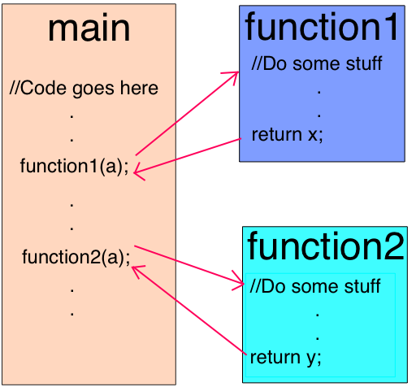
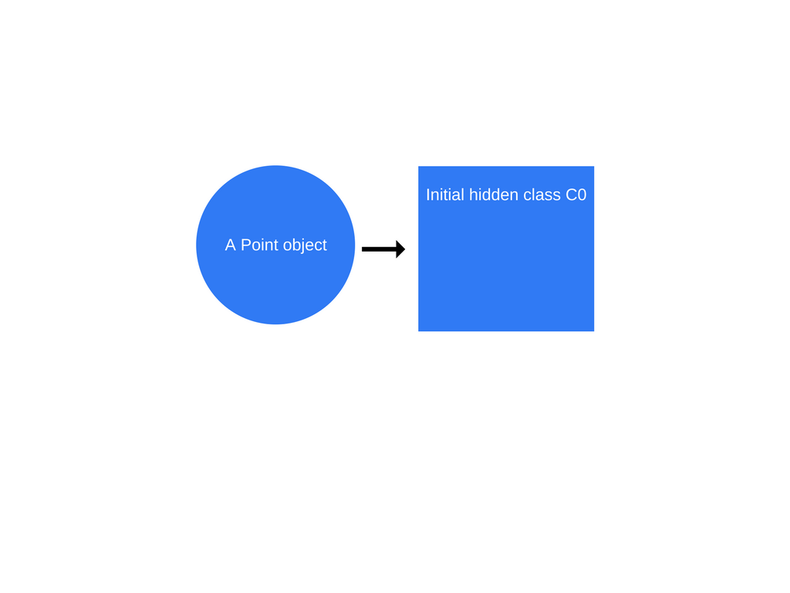
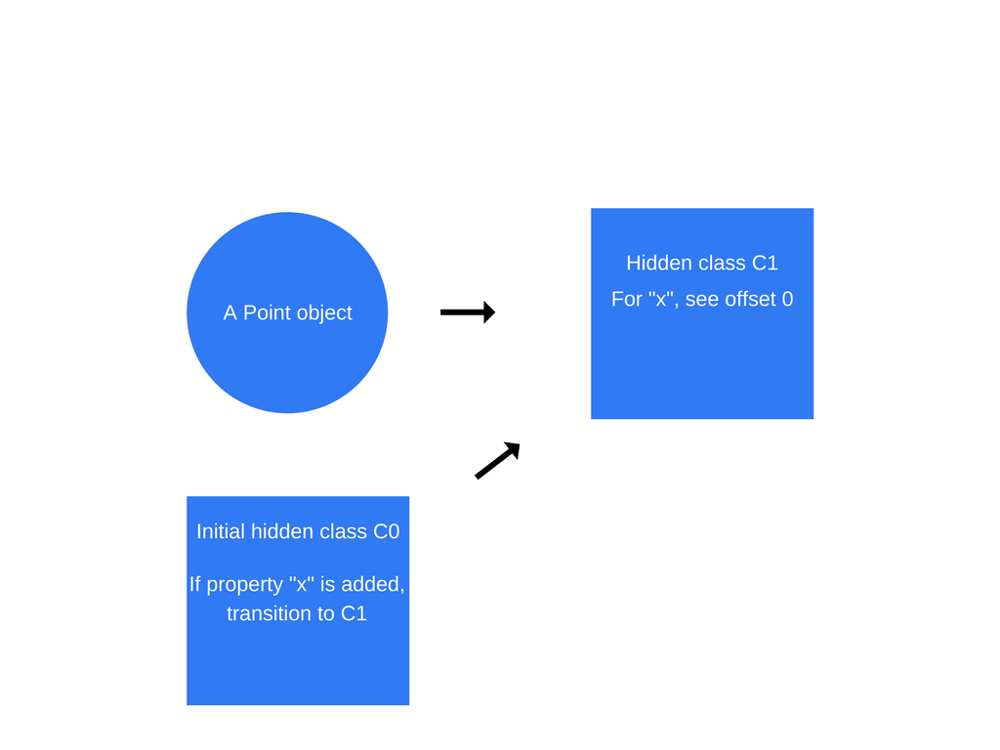
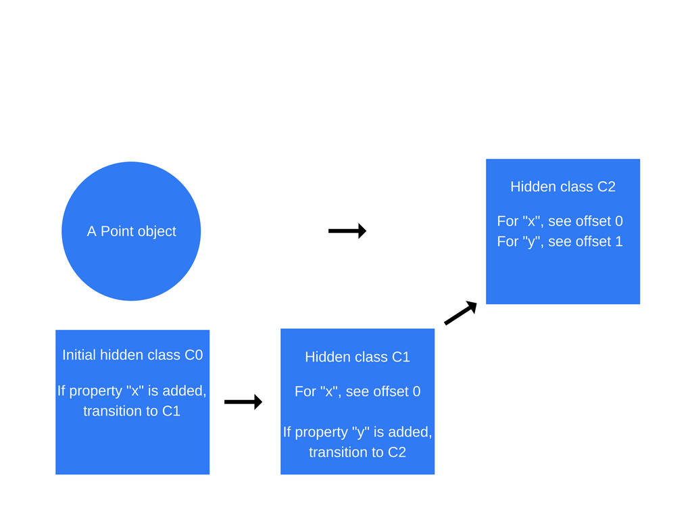
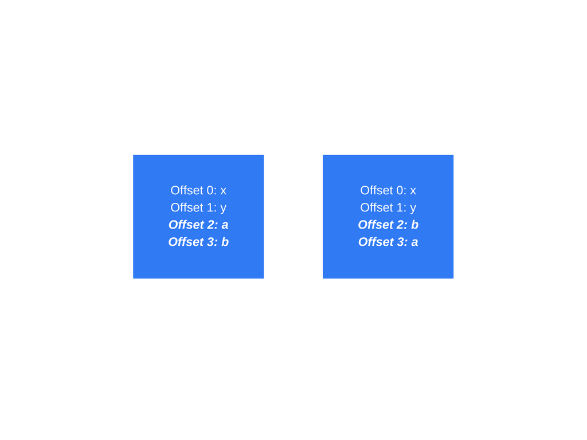
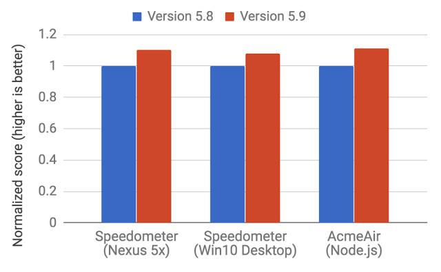

# 如何在 V8 引擎中书写最优代码的 5 条小技巧

> 原文请查阅[这里](https://blog.sessionstack.com/how-javascript-works-inside-the-v8-engine-5-tips-on-how-to-write-optimized-code-ac089e62b12e)，略有删减，本文采用[知识共享署名 4.0 国际许可协议](http://creativecommons.org/licenses/by/4.0/)共享，BY [Troland](https://github.com/Troland)。

**这是  JavaScript 工作原理的第二章。**

本章将会深入谷歌 V8 引擎的内部结构。我们也会为如何书写更好的 JavaScript 代码提供几条小技巧－[SessionStack](https://www.sessionstack.com/) 开发小组在构建产品的时候所遵循的最佳实践。

## 概述

一个 JavaScript 引擎就是一个程序或者一个运行 JavaScript 代码的解释器。一个 JavaScript 引擎可以被当作一个标准解释器或者即时编译器来实现，即时编译器即将 JavaScript 编译为某种形式的字节码。

以下是一系列实现 JavaScript 引擎的热门工程：

* [**V8**](https://en.wikipedia.org/wiki/V8_%28JavaScript_engine%29)－由谷歌开源以 C++ 语言编写
* [**Rhin**](https://en.wikipedia.org/wiki/Rhino_%28JavaScript_engine%29)－由 Mozilla 基金会主导，开源的，完全使用 Java 开发。
* [**SpiderMonkey**](https://en.wikipedia.org/wiki/SpiderMonkey_%28JavaScript_engine%29)－初代 JavaScript 引擎，由在之前由网景浏览器提供技术支持，现在驱动着 Firefox。
* [**JavaScriptCore**](https://en.wikipedia.org/wiki/JavaScriptCore)－开源，以 Nitro 的名称来推广，并由苹果为 Safari 开发。
* [**KJS**](https://en.wikipedia.org/wiki/KJS_%28KDE%29)－KDE 引擎，起先是由 Harri Porten 为 KDE 工程的 Konqueror 浏览器所开发。
* [**Chakra** (JScript9)](https://en.wikipedia.org/wiki/Chakra_%28JScript_engine%29)－IE
* [**Chakra** (JavaScript)](https://en.wikipedia.org/wiki/Chakra_%28JavaScript_engine%29)－Microsoft Edge
* [**Nashorn**](https://en.wikipedia.org/wiki/Nashorn_%28JavaScript_engine%29)－作为 OpenJDK 的一部分来开源，由 Oracle Java 语言和 Tool Group 编写。
* [**JerryScript**](https://en.wikipedia.org/wiki/JerryScript)－一款轻量级的物联网引擎。

## V8 引擎的由来

V8 引擎是由谷歌开源并以 C++ 语言编写。Google Chrome 内置了这个引擎。而 V8 引擎不同于其它引擎的地方在于，它也被应用于流行的 Node.js 运行时中。


起先 V8 是被设计用来优化网页浏览器中的 JavaScript 的运行性能的。为了达到更快的执行速度，V8 把 JavaScript 代码转化为更加高效的机器码来代替使用解释器。它通过实现一个即时编译器在执行阶段把  JavaScript 代码编译为机器码，就像诸如 SpiderMonkey or Rhino (Mozilla) 等许多现代 JavaScript 引擎所做的那样。主要的区别在于 V8 不产生字节码或者任何的中间码。

## V8 曾经拥有两个编译器

在 V8 5.9 诞生(2017 年初) 之前，引擎拥有两个编译器：

* full-codegen－一个简单且快速的编译器用来产出简单且运行相对缓慢的机器码。
* Crankshaft－一个更复杂(即时)优化的编译器用来产生高效的代码。

V8 引擎内部也使用多个线程：

* 主线程做你所期望的事情－抓取代码，编译后执行
* 有独立的线程来编译代码，因此主线程可以保持执行，与此同时前者正在优化代码
* 一个用于性能检测的线程会告诉运行时我们在哪个方法上花了太多的时间，以便于让 Crankshaft 来优化这些代码
* 有几个线程用来处理垃圾回收器的清理工作。

当第一次执行 JavaScript 代码的时候，V8 使用 full-codegen 直接把解析的 JavaScript 代码解释为机器码，中间没有任何转换。这使得它开始非常快速地运行机器码。注意到 V8 没有使用中间字节码来表示，这样就不需要解释器了。

当代码已经执行一段时间后，性能检测器线程已经收集了足够多的数据来告诉 Crankshaft 哪个方法可以被优化。

接下来，在另一个线程中开始进行 Crankshaft 代码优化。它把 JavaScript 语法抽象树转化为一个被称为 **Hydrogen** 的高级静态单赋值表示层并且试着优化该 Hydrogen 图表。大多数的代码优化是发生在这一层。

## 内联

第一个优化方法即是提前尽可能多地内联代码。内联指的是把调用地址(函数被调用的那行代码)置换为被调用函数的正文的过程。这个简单的步骤使得接下来的代码优化更有意义。



## 隐藏类

JavaScript 是基于原型的语言：当进行克隆的时候不会有创建类和对象。JavaScript 也是一门动态编程语言，这意味着在它实例化之后，可以任意地添加或者移除属性。

大多数的 JavaScript 解释器使用类似字典的结构(基于哈希函数)以在内存中存储对象属性值的内存地址。这种结构使得在 JavaScript 中获取属性值比诸如 Java 或者 C# 的非动态编程语言要更耗时。在 Java 中，所有的对象属性都在编译前由一个固定的对象布局所决定并且不能够在运行时动态添加或者删除(嗯， C# 拥有动态类型，这是另外一个话题)。因此，属性值(指向这些属性的指针)以连续的缓冲区的形式存储在内存之中，彼此之间有固定的位移。可以基于属性类型轻易地计算出位移的长度，然而在 JavaScript 中这是不可能的，因为运行时可以改变属性类型。

由于使用字典在内存中寻找对象属性的内存地址是非常低效的，V8 转而使用隐藏类。隐藏类工作原理和诸如 Java 语言中使用的固定对象布局(类)相似，除了它们是在运行时创建的以外。现在，让我们看看他们实际的样子：

```
function Point(x, y) {
  this.x = x;
  this.y = y;
}

var p1 = new Point(1, 2);
```

一旦 "new Point(1,2)" 调用发生，V8 将会创建一个叫做 "C0" 的隐藏类。



因为还没有为类 Point 创建属性，所以 "C0" 是空的。

一旦第一条语句 "this.x = x" 开始执行(在 Point 函数中), V8 将会基于 "C0" 创建第二个隐藏类。"C1" 描述了可以找到 x 属性的内存地址(相对于对象指针)。本例中，"x" 存储在位移 0 中，这意味着把内存中的点对象看作连续的缓冲区的时候，位移起始处即和属性 "x" 保持一致。V8 将会使用 "类转换" 来更新 "C0"，表示若属性 "x" 被添加进点对象，隐藏类将会从 "C0" 转为 "C1"。以下的点对象的隐藏类现在是 "C1"。



*每当对象添加新的属性，使用转换路径来把旧的隐藏类更新为新的隐藏类。隐藏类转换是重要的，因为它们使得以同样方式创建的对象可以共享隐藏类。如果两个对象共享一个隐藏类并且两个对象添加了相同的属性，转换会保证两个对象收到相同的新的隐藏类并且所有的优化过的代码都会包含这些新的隐藏类。*

当运行 "this.y = y" 语句的时候，会重复同样的过程(还是在 Point 函数中，在 "this.x = x" 语句之后)。

一个被称为 "C2" 的隐藏类被创造出来，一个类转换被添加进 "C1" 中表示属性 "y" 若被添加进点对象(已经拥有属性 "x")之后隐藏类会更改为 "C2"，然后点对象的隐藏类会更新为 "C2"。



隐藏类转换依赖于属性被添加进对象的顺序。看如下的代码片段：

```
function Point(x, y) {
  this.x = x;
  this.y = y;
}

var p1 = new Point(1, 2);
p1.a = 5;
p1.b = 6;

var p2 = new Point(3, 4);
p2.b = 7;
p2.a = 8;
```

现在，你会以为 p1 和 p2 会使用相同的隐藏类和类转换。然而，并非如此。对于 "p1"，先添加属性 "a" 然后再添加属性 "b"。对于 "p2"，先添加属性 "b" 然后是 "a"。这样，由于使用不同的转换路径， "p1" 和 "p2" 最终使用不同的隐藏类。在这种情况下，更好的方法是以相同的顺序初始化动态属性以便于复用隐藏类。

## 内联缓存

V8 利用了另一项优化动态类型语言的技术叫做内联缓存。内联缓存依赖于对于同样类型的对象上的同样方法的重复调用的观察。这里有一份深入阐述内联缓存的[文章](https://github.com/sq/JSIL/wiki/Optimizing-dynamic-JavaScript-with-inline-caches)。

我们将会接触到内联缓存的大概概念(万一你没有时间去通读以上的深入理解内联缓存的文章)。

它是如何工作的呢？V8 会维护一份传入最近调用方法作为参数的对象类型的缓存，然后使用这份信息假设在未来某个时候这个对象类型将会被传入这个方法。如果 V8 能够很好地预判即将传入方法的对象类型，它就可以绕过寻找如何访问对象属性的过程，代之以使用储存的来自之前查询到的对象隐藏类的信息。

所以隐藏类的概念和内联缓存是如何联系在一起的呢？每当在一个指定的对象上调用方法的时候，V8 引擎不得不执行查找对象隐藏类的操作，用来取得访问指定属性的位移。在两次对于相同隐藏类的相同方法的成功调用之后，V8 忽略隐藏类的查找并且只是简单地把属性的位移添加给对象指针自身。在之后所有对这个方法的调用，V8 引擎假设隐藏类没有改变，然后使用之前查找到的位移来直接跳转到指定属性的内存地址。这极大地提升了代码运行速度。

内存缓存也是为什么同样类型的对象共享隐藏类是如此重要的原因。当你创建了两个同样类型的对象而使用不同的隐藏类(正如之前的例子所做的那样)，V8 将不可能使用内存缓存，因为即使相同类型的两个对象，他们对应的隐藏类为他们的属性分派不同的位移。



*这两个对象基本上是一样的但是创建 "a" 和 "b" 的顺序是不同的*

## 编译为机器码

一旦优化了 Hydrogen 图表，Crankshaft 会把它降为较低级的展现叫做 Lithium。大多数 Lithium 的实现都是依赖于特定的架构。寄存器分配发生在这一层。

最后，Lithium 会被编译为机器码。之后其它被称为 OSR 的事情发生了：当前栈替换。在开始编译和优化一个明显的耗时的方法之前，过去极有可能去运行它。V8 将不会忘记代码执行缓慢的地方来再次使用优化过的版本代码。相反，它会转换所有的上下文(栈，寄存器)，这样就可以在执行过程中切换到优化的版本代码。这是一个复杂的任务，你只需要记住的是，在其它优化过程中，V8 会初始化内联代码。V8 并不是唯一拥有这项能力的引擎。

这里有被称为逆优化的安全防护，以防止当引擎所假设的事情没有发生的时候，可以进行逆向转换和把代码反转为未优化的代码。

## 垃圾回收

V8 使用传统的分代标记-清除技术来清理老旧的代码生成以进行垃圾回收。标记阶段会中止 JavaScript 的运行。为了控制垃圾回收的成本并且使得代码执行更加稳定，V8 使用增量标记法：不遍历整个内存堆，试图标记每个可能的对象，它只是遍历一部分堆，然后重启正常的代码执行。下一个垃圾回收点将会从上一个堆遍历中止的地方开始继续进行。这会在正常的代码执行过程中有一个非常短的暂停。之前提到过，清除阶段是由单独的线程处理的。

## Ignition 和 TurboFan

随着 2017 早些时候 V8 5.9 版本的发布，带来了一个新的执行管道。新的管道为现实 JavaScript 程序带来更大的性能提升和显著地节省内存。

新的执行管道是建立在新的 V8 解释器  Ignition 和 V8 最新的优化编译器 TurboFan 之上的。

你可以查看 V8 小组的[博文](https://v8project.blogspot.bg/2017/05/launching-ignition-and-turbofan.html)。

自从 V8 5.9 版本发布以来，full-codegen 和 Crankshaft(V8 从 2010 开始使用至今) 不再被 V8 用来运行JavaScript，因为 V8 小组正努力跟上新的 JavaScript 语言功能以及为这些功能所做的优化。

这意味着接下来整个 V8 将会更加精简和更具可维护性的架构。



*网页和 Node.js benchmarks 评分的提升*

这些提升只是一个开始。新的 Ignition 和 TurboFan 管道为未来的优化作准备，它会在未来几年内提升 JavaScript 性能和减少 Chrome 和 Node.js 中的 V8 痕迹。

最后，这里有一些如何写出优化良好的，更好的 JavaScript 代码。你可以很容易地从以上的内容中总结出来，然而，为了方便你，下面有份总结：

## 如何写优化的 JavaScript 代码

* 对象属性的顺序：总是以相同的顺序实例化对象属性，这样隐藏类及之后的优化代码都可以被共享。
* 动态属性：实例化之后为对象添加属性会致使为之前隐藏类优化的任何方法变慢。相反，在对象构造函数中赋值对象的所有属性。
* 方法：重复执行相同方法的代码会比每次运行不同的方法的代码更快(多亏了内联缓存)。
* 数列：避免使用键不是递增数字的稀疏数列。稀疏数列即没有包含每个元素在其内部称为一个哈希表。访问该数列中的元素会更加耗时。同样地，试着避免预先分配大数组。最好是随着使用而递增。最后，不要删除数列中的元素。这会让键稀疏。
* 标记值：V8 用 32 位来表示对象和数字。它使用一位来辨别是对象(flag=1)或整数 (flag=0) 称为 SMI(小整数) ，之所以是小整数是因为它是 31 位的。之后，如果一个数值比 31 位还要大，V8 将会装箱数字，把它转化为浮点数并且创建一个新的对象来存储这个数字。尽可能试着使用 31 位有符号数字来避免创建 JS 对象的耗时装箱操作。


